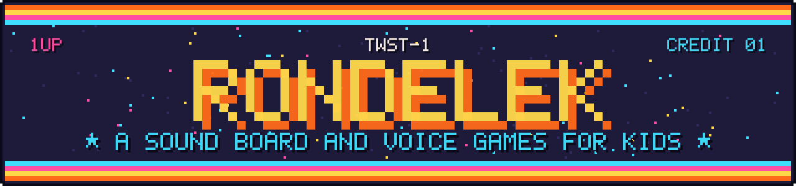
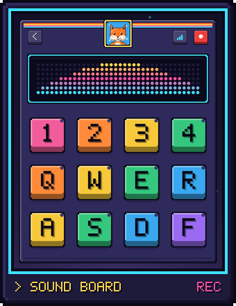
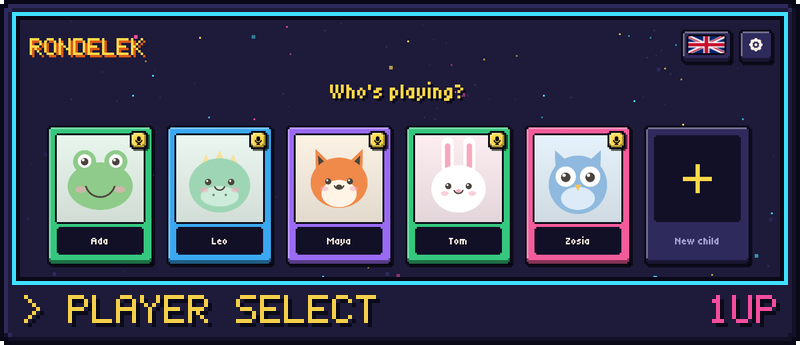
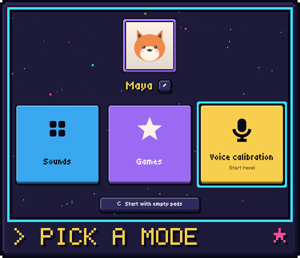
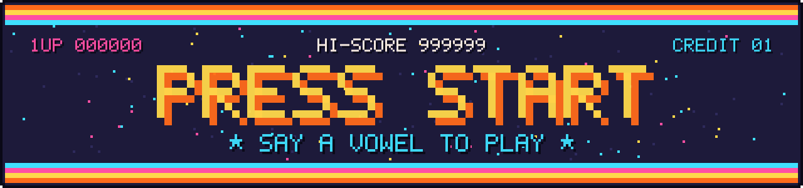

<p align="center">
  
</p>

**Rondelek is a little arcade of sounds for kids.** Your child records a funny
noise onto a big colourful key, taps it, and hears it come right back. Then
they switch to a game and steer it with nothing but their voice: say *“aaa”*
and the hero jumps. It's a toy first, and a sneaky bit of practice with sounds
and vowels along the way.

It runs on your own computer, with no accounts, no internet and no ads.
Every child in the family gets their own card, picture and recordings.

## Two ways to play

<table>
  <tr>
    <td align="center" valign="top" width="40%">
      
    </td>
    <td align="center" valign="top" width="60%">
      <picture>
        <source media="(prefers-reduced-motion: reduce)" srcset="docs/images/arcade/runner.png">
        
      </picture>
    </td>
  </tr>
  <tr>
    <td valign="top">
      <b>🎛 The sound board.</b> Twelve big keys, and every one can hold a
      sound. Hold a key to record a giggle, a growl or a “ba-ba-ba”, then tap
      it to hear it again, as often as they like. The little screen dances
      along with their voice, or shows which vowel it hears.
    </td>
    <td valign="top">
      <b>🎮 Voice games.</b> In <b>Vowel Runner</b> the child's voice is the
      controller: one vowel jumps, another ducks, a third throws a star. A
      grown-up picks which vowel does what, and which obstacles show up. A
      miss just bounces off, and the golden sun spins round for every point.
      <br><br><i>More games are on the way.</i>
    </td>
  </tr>
</table>

## Quick start

It takes about five minutes, and one of them is the important one.

**1. Get Rondelek** from the [latest release](https://github.com/pipejesus/rondelek-twst-1/releases/latest)
(Windows and Linux, see [Download](#download) below) and open it.

**2. Make a card for your child.** On *Who's playing?* press **New child**,
type their name and pick a picture: a cartoon animal, a webcam photo, or any
image you like.

<p align="center">
  
</p>

**3. Do the voice calibration together. Please don't skip this one!**
Tap your child's card, then the yellow **Voice calibration** tile. The app
shows six vowels, *a e i o u y*. Tap one, hold the big button, and let your
child say the sound and keep it going for a moment, like a little song:
*“aaaaa”*. Do that for all six. It takes a minute or two.

<table>
  <tr>
    <td align="center" width="50%"></td>
    <td align="center" width="50%"></td>
  </tr>
</table>

Why it matters so much: every child's voice is different, and so is every
microphone. Calibration is how Rondelek learns what *your* child's vowels
sound like. Without it, the games and the vowel screen simply can't
understand them. With it, they respond to your child's own voice.

A few things that help:

- Record with the **same microphone** your child will play with, in a quiet-ish room.
- Two or three takes per vowel (a bit higher, a bit lower, a bit louder) make
  recognition noticeably better.
- Got a new microphone, or does the game seem confused? Just calibrate again.
  It's quick, and the grown-ups page will even tell you when the microphone
  has changed since the last calibration.

**4. Play!** **Sounds** opens the sound board, and **Games** opens the voice
games. The sound board remembers everything, so next time your child carries
on right where they left off.

There's more about each step in the [Rondelek book](https://pipejesus.github.io/rondelek-twst-1/),
including a friendly [guide to voice calibration](https://pipejesus.github.io/rondelek-twst-1/voice-calibration.html).

<p align="center">
  
</p>

## Download

Everything is on the [latest release](https://github.com/pipejesus/rondelek-twst-1/releases/latest)
page, under **Assets**.

- **Windows:** download the `.zip`, unzip it anywhere, and double-click
  **`rondelek.exe`**. Keep it next to `rondelek-game.exe`, because that's where
  the games live. If Windows says *“Windows protected your PC”*, click
  **More info → Run anyway**. (The app just isn't code-signed; that costs money
  every year.)
- **Linux:** download the `.AppImage`, allow it to run as a program
  (right-click → *Properties*), and double-click it. Nothing to install.
- **macOS:** no ready-made download yet, but it builds from source with a few
  commands.

The book has [more install details](https://pipejesus.github.io/rondelek-twst-1/getting-started.html)
if you'd like them.

## For grown-ups

- **Everything stays on your computer.** Children, pictures and recordings
  are ordinary files in a folder you can open from the app. Nothing is sent
  anywhere.
- **One settings page, just for you.** The ⚙ key (or `F12`) opens
  *For grown-ups*: speakers and microphone, how picky the voice recognition
  should be, the language, the look of the sound board, and each child's
  profile. You'll also find **every earlier session** of the sound board
  there, ready to open again.
- **Seven languages:** English, Polski, Deutsch, Français, Español, Italiano
  and Українська.

The [grown-ups guide](https://pipejesus.github.io/rondelek-twst-1/grown-ups.html)
walks through the whole page.

## Curious how it's made?

Rondelek is written in Rust, with [egui](https://github.com/emilk/egui) for
the app and [raylib](https://www.raylib.com/) for the games. If you have
[Rust](https://rustup.rs) installed, this builds and runs it:

```bash
git clone https://github.com/pipejesus/rondelek-twst-1.git rondelek
cd rondelek
cargo run --release
```

From there, [Building from source](https://pipejesus.github.io/rondelek-twst-1/building.html)
covers each platform and the everyday commands, and the rest of the
[book](https://pipejesus.github.io/rondelek-twst-1/) shows you around the code.
Contributor rules are in [`AGENTS.md`](AGENTS.md). Sound-board skins have their
own guide in [`docs/SKINS.md`](docs/SKINS.md).

## License

MIT (see `Cargo.toml`). The bundled Space Grotesk and Tiny5 fonts are under the
SIL Open Font License (`assets/fonts/`), the language flags are public domain,
and the character pictures are the project's own (`assets/avatars/`).
