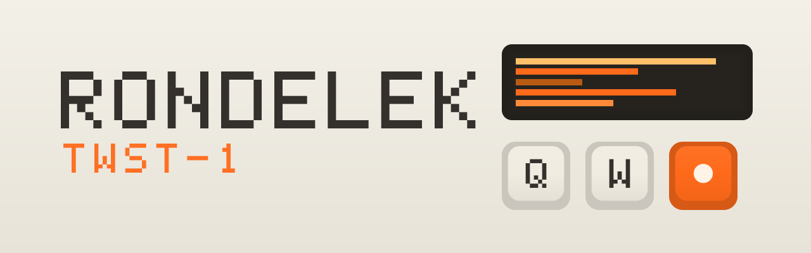
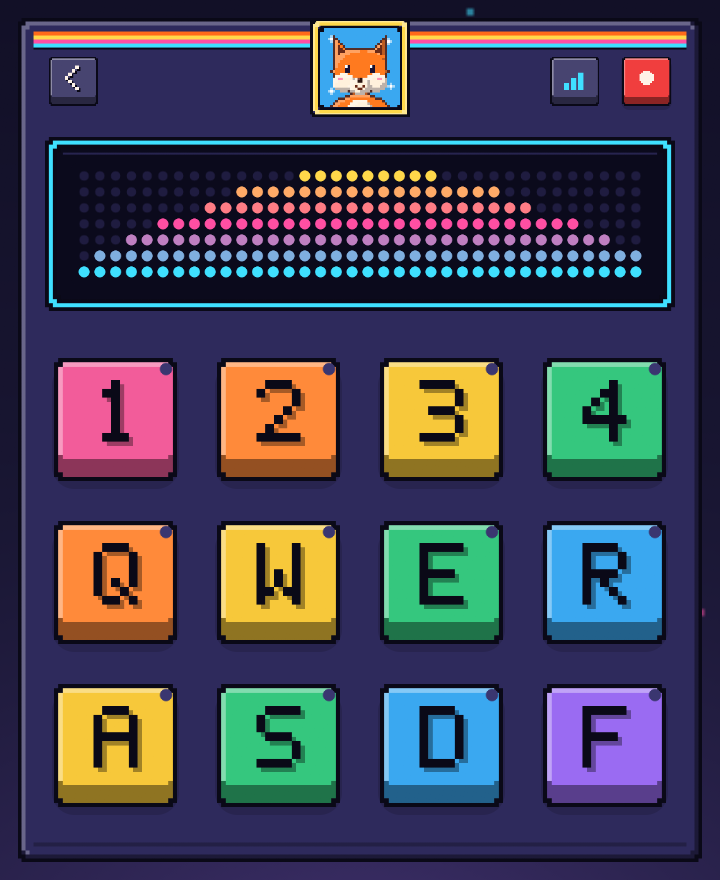

<p align="center">
  
</p>

# Rondelek TWST-1

> A playful audio sampler for children with hearing implants — record short
> sounds onto pads and play them back, turning speech and hearing practice into a
> game.

<p align="center">
  
</p>

Rondelek is a small, self-contained desktop app written in **Rust** with
[`egui`](https://github.com/emilk/egui). One install serves many children: each
child gets a **profile**, and each practice run is a **session** of recordings
saved to disk. No accounts, no network, no database — just folders you own.

---

## Quick start

If you've never touched Rust before, this is all you need.

### 1. Install Rust

Rust is installed with **`rustup`**, the official toolchain manager. Grab it from
[rustup.rs](https://rustup.rs) (on macOS/Linux it's one command):

```bash
curl --proto '=https' --tlsv1.2 -sSf https://sh.rustup.rs | sh
```

Then restart your terminal and check it works:

```bash
rustc --version   # should print 1.88 or newer (edition 2024 + let-chains)
```

### 2. Get the code

```bash
git clone <this-repo-url> rondelek
cd rondelek
```

### 3. Run it

```bash
cargo run --release
```

The first build compiles every dependency and takes a few minutes — that's
normal, and it's cached afterwards. The app window opens straight to the profile
picker.

> ### ⚡ Always use `--release` — especially for the webcam
>
> `cargo run` (without a flag) makes a **debug** build: fast to compile, but the
> image and audio code runs *unoptimized*. The webcam preview is the dramatic
> case — decoding and scaling each frame costs:
>
> | Build | Per frame | Live preview |
> |-------|-----------|--------------|
> | `cargo run` (debug) | ~1300 ms | **~1 fps** (painfully laggy) |
> | `cargo run --release` | ~38 ms | **~26 fps** (smooth) |
>
> That's a ~34× difference. If the camera feels like a slideshow, you're almost
> certainly on a debug build. **Develop with `--release`.**

---

## Building a standalone binary

To produce an optimized executable you can copy and run anywhere:

```bash
cargo build --release
```

This builds **two** executables in `target/release/`: the sampler
**`rondelek`** and the voice-game runner **`rondelek-game`** (`.exe` on
Windows). Fonts, translations, flags, the base skin, shaders and 3D models are
embedded, but the sampler launches games by running `rondelek-game` from its own
folder, so **always ship and copy both files together**.

---

## Platform notes

Rondelek's primary platform is **macOS**; Linux and Windows are supported too.

### macOS
Nothing extra to install — audio (CoreAudio) and camera (AVFoundation) are
built in. The **first** time you use *Take photo*, macOS asks for camera
permission. If you decline, the app just shows "Camera unavailable" and
everything else keeps working. (You can re-enable it later under *System
Settings → Privacy & Security → Camera*.)

### Linux
You'll need a few system development packages for audio, file dialogs, the
window/GL surface, and the webcam. On Debian/Ubuntu:

```bash
sudo apt install build-essential pkg-config cmake clang \
  libasound2-dev libgtk-3-dev libudev-dev libv4l-dev \
  libx11-dev libxcb1-dev libxrandr-dev libxinerama-dev libxcursor-dev \
  libxi-dev libgl1-mesa-dev
```

`cmake`, `clang` and the X11/GL headers are for raylib, which the voice-game
binary compiles from source.

Package names vary by distro — if a build fails, the compiler error usually
names the missing library.

### Windows
Install the **MSVC C++ Build Tools** (the "Desktop development with C++"
workload from the Visual Studio Installer), then `rustup` and `cargo` work as
above. Audio and camera use the built-in Windows APIs.

---

## Everyday development

```bash
cargo run --release          # build and run (games are rebuilt on launch)
cargo test                   # run the test suite
cargo fmt --all              # auto-format the code
cargo clippy --all-targets   # lint for common mistakes
```

**Branches & worktrees.** `develop` is the main branch. Every feature or fix gets
its own branch and its own worktree under `.claude/worktrees/`, and is merged
back by pull request. The full workflow is in `AGENTS.md`.

**Git hooks (optional but recommended).** The repo ships a formatting gate that
runs before each commit. Enable it once per clone:

```bash
git config core.hooksPath .githooks
```

**Translations must stay in sync.** `assets/i18n/en.json` is the source of truth;
every seeded locale (`pl, de, fr, es, it, uk`) must carry the same keys. A test
(`cargo test`) fails if they drift. See `AGENTS.md` for the full contributor rule.

---

## Voice games

The vowel engine powers mini-games (raylib, own fullscreen window, launched
from a profile's **Games** menu as a separate process). First game: **Vowel
Runner** — say one vowel to jump, hold another to duck; misses just bounce
away, every cleared obstacle is a star. Rendered in blocky 2.5D (raylib
perspective camera): parallax clouds/mountains/bushes/ground built from chunky
bricks, a fog shader on the far mountains, and a comic-style toon shader slot
on the hero placeholder (a dragon GLB will take it over later). The selection
screen also carries a wordless turtle↔rabbit Reaction slider (persisted as
`game_reaction`) that trades detection steadiness for snappiness in games. Each game opens on a text-free
control-selection screen where the therapist assigns a vowel to each move
(▲ jump / ▼ duck / ★ shoot slots, letter cards), toggles which obstacle kinds
appear, and presses ▶. Detection is then restricted to the chosen vowels, so
confusable unchosen ones (e.g. e vs y) can't cause misfires. Keyboard keys A/E/I/O/U/Y simulate vowels for
testing or playing without a mic; Esc returns to the sampler.

Run a game directly: `cargo run -p rondelek-game -- runner --profile <profile-dir>`.
It's a separate binary/crate (`game/`) from the sampler app (`app/`), sharing
audio/config/profile logic through `core/` — raylib and the app's eframe/winit
stack both define a Windows `ShowCursor` symbol, so they can't share a link.
Adding a game = implement `VoiceGame` (`game/src/`), register it in the
`match` in `game::run` and in `rondelek_core::games::GAMES` (a `GameInfo`
with its id and i18n name + tagline keys), then add those keys to every locale. The pre-game selection screen is still
Runner-specific (`select_controls` returns the Runner's moves and obstacle
toggles) and must be generalised for a second game.

---

## Skins

The whole faceplate is image-driven. The built-in **Base** skin lives in
[`skins/base/`](skins/base/) (generated by `cargo run --bin genskin`), and
designers can make their own — a zip with a `skin.json` and a single `skin.png`
spritesheet, dropped into the user skins folder. See [docs/SKINS.md](docs/SKINS.md).
The repo's [`skins/index.json`](skins/index.json) catalogs skins available here.

---

## Controls

| Input | Action |
|-------|--------|
| `1 2 3 4` / `Q W E R` / `A S D F` | trigger the 12 sample pads |
| `Space` | toggle **REC** mode |
| *(REC mode)* hold a pad | record while held; release or `Esc` to stop |
| *(play mode)* tap a pad | play its sample |
| button left of REC | cycle the visualizer (spectrum → vowel meter → off) |
| `F12` | open / close the settings page ("For grown-ups") |
| `Ctrl+Shift+S` | save a screenshot |

---

## Performance note (Linux/Wayland)

winit's Wayland backend busy-spins between compositor frame callbacks, which
can burn a full CPU core while the sampler screen animates. If fans spin up,
launch with the `--x11` flag to run under XWayland instead, which blocks
properly on vsync:

```sh
cargo run --release -- --x11
```

Static screens idle at a slow repaint heartbeat on either backend, so the fix
matters mainly for the sampler/calibration screens.

---

## Handy environment variables

Useful for testing, demos, and screenshots — they jump straight to a screen and
(optionally) capture a frame:

| Variable | Effect |
|----------|--------|
| `RONDELEK_LANG=de` | start in a specific language |
| `RONDELEK_SIZE=640x760` | set the initial window size |
| `RONDELEK_PROFILE=<dir>` | open that child's hub |
| `RONDELEK_SESSION=<dir>` | jump straight into a session (the sampler) |
| `RONDELEK_SCREEN=newprofile` \| `editprofile` \| `calibrate` \| `games` \| `settings` | open that screen (`editprofile`, `calibrate`, `games` need `RONDELEK_PROFILE`) |
| `RONDELEK_CALIB_VOWEL=<n>` | with `calibrate`: open vowel *n*'s record screen |
| `RONDELEK_VIZ=<n>` | select visualizer *n* (0 spectrum, 1 vowels, 2 off) |
| `RONDELEK_SHOT=<file.png>` | render a few frames, save a screenshot, and exit |
| `RONDELEK_GAME_SCREEN=select` | *(game)* run the harness on the selection screen |
| `RONDELEK_GAME_FRAMES=<n>` / `RONDELEK_GAME_SHOT=<png>` | *(game)* quit after *n* frames / save a screenshot |

Example — capture the sampler screen and quit:

```bash
RONDELEK_SESSION="$HOME/Library/Application Support/rondelek/profiles/<id>/sessions/<ts>" \
RONDELEK_SHOT=out.png cargo run --release
```

---

## How it works (the short version)

- **Profiles → sessions**, stored as plain folders under your OS data directory
  (`…/rondelek/profiles/<slug>-<id>/`), each with a small JSON manifest and, for
  a profile, an optional square `avatar.png`.
- **Screens:** *Who's playing?* (a tile per child) → the child's *hub* (Sounds,
  Games, Voice check) → the *Sampler*. Also a *profile form* (name + a character,
  photo or uploaded picture), the *voice check* (record the six vowels
  a e i o u y) and one *settings page* for grown-ups. There are no pop-up
  windows.
- **Vowel detection** matches the child's voice against their own calibrated
  MFCC templates. The vowel visualizer and the games share it.
- **Audio is mono end-to-end**, captured at the device rate and resampled on
  playback so pitch stays correct.
- **Visualizers** are CPU-rendered (no GPU shader, so maximally portable): an amber
  dot-matrix spectrum and a vowel meter.

For the full architecture see the developer handbook in [`docs/`](docs/src/introduction.md).
The module map and contributor rules are in [`AGENTS.md`](AGENTS.md).

---

## License

MIT — see the `license` field in `Cargo.toml`. The bundled Space Grotesk font is
under the SIL Open Font License (`assets/fonts/`), and the picker flags are
public domain.
