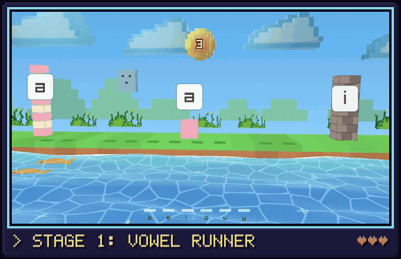

<p align="center">
  
</p>

# Rondelek TWST-1

> A playful audio sampler for children with hearing implants — record short
> sounds onto pads and play them back, turning speech and hearing practice into a
> game.

<p align="center">
  
</p>

<p align="center">
  <picture>
    <source media="(prefers-reduced-motion: reduce)" srcset="docs/images/arcade/runner.png">
    
  </picture>
  <br>
  <sub><b>Vowel Runner</b>: the child's voice is the controller. Say a vowel to jump,
  duck or fire a star; grown-ups pick which vowel does what.</sub>
</p>

<p align="center">
  
</p>

<p align="center">
  
  &nbsp;
  
</p>

Rondelek is a small, self-contained desktop app. One install serves many
children: each child gets their own tile, picture and recordings. There are no
accounts, no network and no database; everything stays in plain folders on
your computer.

---

## Download

Ready-made downloads are on the
[latest release](https://github.com/pipejesus/rondelek-twst-1/releases/latest)
page, under **Assets**.

### Windows

1. Download the `.zip` (`…-windows-msvc.zip`).
2. Unzip it anywhere, e.g. into *Documents*.
3. Double-click **`rondelek.exe`**.

Keep **`rondelek.exe` and `rondelek-game.exe` in the same folder**: the app
starts the games from there.

The first time, Windows may show *“Windows protected your PC”*. The app isn't
code-signed (that costs money every year), so click **More info → Run anyway**.

### Linux

1. Download **`rondelek-…-x86_64.AppImage`**: one file, nothing to install.
2. Make it executable: right-click → *Properties* → *Allow executing as a
   program*, or in a terminal `chmod +x rondelek-*.AppImage`.
3. Double-click it.

It runs on Ubuntu 22.04 or newer, Debian 12+, Fedora, Arch and other current
distros. To start the games on their own, run it with `--game`. To get a menu
entry and one-click updates, open it with
[Gear Lever](https://flathub.org/apps/it.mijorus.gearlever). A plain
`.tar.gz` of the same two programs is there too.

### macOS

No ready-made download yet: build it from source (below); it's a few commands.

---

## Using Rondelek (for parents and therapists)

1. **Add a child**: on *Who's playing?* press **+ New child**, type a name and
   pick a picture: a cartoon character, a webcam photo, or an image file.
2. **Voice check**: in the child's hub, press **Voice check** and record the six
   vowels (*a e i o u y*). Tap a vowel, then hold the big button while the child
   says it. Two or three takes per vowel, at different pitch and loudness, make
   recognition better. The vowel screen and the games need this.
3. **Sounds**: the sampler. Press **REC** (or `Space`), then hold a pad to record
   into it; press REC again and tap pads to play them back. The board is kept, so
   next time the child continues where they left off.
4. **Games**: voice-controlled games. Before each game you choose which vowel
   makes the hero jump, duck or shoot, and which obstacles appear. The game also
   works on its own: double-click **`rondelek-game.exe`** (on Linux, run the
   AppImage with `--game`) and it first asks who's
   playing (the same children and pictures as in the app), then starts.
5. **For grown-ups**: the ⚙ key (or `F12`) opens one settings page: speaker and
   microphone, how picky voice recognition is, the sampler screen, language, and
   the child's own settings (rename, redo the voice check, delete).

Deleting a child moves their folder to a `.trash` folder inside the library
instead of erasing it, so it can be recovered.

---

## Building from source

If you've never touched Rust before, this is all you need.

### 1. Install Rust

Rust is installed with **`rustup`**, the official toolchain manager. Grab it from
[rustup.rs](https://rustup.rs) (on macOS/Linux it's one command):

```bash
curl --proto '=https' --tlsv1.2 -sSf https://sh.rustup.rs | sh
```

Then restart your terminal and check it works:

```bash
rustc --version   # should print 1.88 or newer (edition 2024 + let-chains)
```

### 2. Get the code

```bash
git clone https://github.com/pipejesus/rondelek-twst-1.git rondelek
cd rondelek
```

### 3. Run it

```bash
cargo run --release
```

The first build compiles every dependency and takes a few minutes. That's
normal, and it's cached afterwards. The app opens on *Who's playing?*.

> ### ⚡ Always use `--release` — especially for the webcam
>
> `cargo run` (without a flag) makes a **debug** build: fast to compile, but the
> image and audio code runs *unoptimized*. The webcam preview is the dramatic
> case — decoding and scaling each frame costs:
>
> | Build | Per frame | Live preview |
> |-------|-----------|--------------|
> | `cargo run` (debug) | ~1300 ms | **~1 fps** (painfully laggy) |
> | `cargo run --release` | ~38 ms | **~26 fps** (smooth) |
>
> That's a ~34× difference. If the camera feels like a slideshow, you're almost
> certainly on a debug build. **Develop with `--release`.**

---

## Building a standalone binary

To produce an optimized executable you can copy and run anywhere:

```bash
cargo build --release
```

This builds **two** executables in `target/release/`: the sampler
**`rondelek`** and the voice-game runner **`rondelek-game`** (`.exe` on
Windows). Fonts, translations, flags, the base skin, shaders and 3D models are
embedded, but the sampler launches games by running `rondelek-game` from its own
folder, so **always ship and copy both files together**.

---

## Platform notes

Rondelek runs on **Windows, macOS and Linux**. Ready-made downloads are
built for Windows and Linux (an AppImage; see
[`packaging/appimage`](packaging/appimage/README.md)).

### macOS
Nothing extra to install — audio (CoreAudio) and camera (AVFoundation) are
built in. The **first** time you use *Take photo*, macOS asks for camera
permission. If you decline, the app just shows "Camera unavailable" and
everything else keeps working. (You can re-enable it later under *System
Settings → Privacy & Security → Camera*.)

### Linux
You'll need a few system development packages for audio, file dialogs, the
window/GL surface, and the webcam. On Debian/Ubuntu:

```bash
sudo apt install build-essential pkg-config cmake clang \
  libasound2-dev libgtk-3-dev libudev-dev libv4l-dev \
  libx11-dev libxcb1-dev libxrandr-dev libxinerama-dev libxcursor-dev \
  libxi-dev libgl1-mesa-dev
```

`cmake`, `clang` and the X11/GL headers are for raylib, which the voice-game
binary compiles from source.

Package names vary by distro — if a build fails, the compiler error usually
names the missing library.

### Windows
Install the **MSVC C++ Build Tools** (the "Desktop development with C++"
workload from the Visual Studio Installer), then `rustup` and `cargo` work as
above. Audio and camera use the built-in Windows APIs.

---

## Everyday development

```bash
cargo run --release          # build and run (games are rebuilt on launch)
cargo test                   # run the test suite
cargo fmt --all              # auto-format the code
cargo clippy --all-targets   # lint for common mistakes
```

**Branches & worktrees.** `develop` is the main branch. Work happens on a branch
in its own worktree under `.claude/worktrees/` (usually one per session) and
lands on `develop` as a fast-forward. The full workflow is in `AGENTS.md`.

**Git hooks (optional but recommended).** `pre-commit` checks formatting and
`pre-push` runs clippy and the tests (the same checks as CI). Enable them once
per clone:

```bash
git config core.hooksPath .githooks
```

**Translations must stay in sync.** `assets/i18n/en.json` is the source of truth;
every seeded locale (`pl, de, fr, es, it, uk`) must carry the same keys. A test
(`cargo test`) fails if they drift. See `AGENTS.md` for the full contributor rule.

---

## Voice games

The vowel engine powers mini-games (raylib, in their own fullscreen window,
launched from a child's **Games** tile as a separate process). The first game
is **Vowel Runner**: say one vowel to jump, another to duck, a third to shoot
stars. Misses just bounce away, and every cleared obstacle earns a point: the
hand-drawn pixel sun with the count on its face whirls round once per point and
comes back showing the new number, like a coin flipping over. It's
rendered in blocky 2.5D under a bright blue sky: parallax clouds and bushes
(hand-drawn `flat-draw` models; the clouds bob and breathe through flat-draw's
Lam::pula glass shader), fog-shaded hills, a toon-shaded hero, and a playful
sea along the front, with goldfish, foam and twinkles, whose waves dance
when the child makes a sound.

Each game opens on a text-free control screen where the grown-up assigns a
vowel to each move (▲ jump / ▼ duck / ★ shoot), toggles which obstacle kinds
appear, sets the turtle↔rabbit **Reaction** slider (steadier ↔ snappier; also on
the settings page as `game_reaction`), and presses ▶. Detection is then limited
to the chosen vowels, so sound-alikes that weren't picked (e.g. e vs y) can't
cause misfires. Keys A/E/I/O/U/Y simulate vowels for testing without a mic; Esc
closes the game and returns to the app.

Run a game directly: `cargo run -p rondelek-game` (asks who's playing), or
`cargo run -p rondelek-game -- runner --profile <profile-dir>` (what the app does).
It's a separate binary/crate (`game/`) from the sampler app (`app/`), sharing
audio/config/profile logic through `core/` — raylib and the app's eframe/winit
stack both define a Windows `ShowCursor` symbol, so they can't share a link.
Adding a game = implement `VoiceGame` (`game/src/`), register it in the
`match` in `game::run` and in `rondelek_core::games::GAMES` (a `GameInfo`
with its id and i18n name + tagline keys), then add those keys to every
locale. Every game gets the "who's playing?" picker for free
(`game/src/profile_picker.rs`, reusable via `profile_picker::choose_child`).
The pre-game selection screen is still Runner-specific (`select_controls` returns the Runner's moves and obstacle
toggles) and must be generalised for a second game.

---

## Skins

The whole faceplate is image-driven. The built-in **Base** skin lives in
[`skins/base/`](skins/base/) (generated by `cargo run --bin genskin`), and
designers can make their own — a zip with a `skin.json` and a single `skin.png`
spritesheet, dropped into the user skins folder. See [docs/SKINS.md](docs/SKINS.md).
The repo's [`skins/index.json`](skins/index.json) catalogs skins available here.

---

## Controls

| Input | Action |
|-------|--------|
| `1 2 3 4` / `Q W E R` / `A S D F` | trigger the 12 sample pads |
| `Space` | toggle **REC** mode |
| *(REC mode)* hold a pad | record while held; release or `Esc` to stop |
| *(play mode)* tap a pad | play its sample |
| button left of REC | cycle the visualizer (spectrum → vowel meter → off) |
| *(voice check)* hold `Space` | record the vowel on screen |
| `F12` | open / close the settings page ("For grown-ups") |
| `Ctrl+Shift+S` | save a screenshot |

---

## Performance note (Linux/Wayland)

winit's Wayland backend busy-spins between compositor frame callbacks, which
can burn a full CPU core while the sampler screen animates. If fans spin up,
launch with the `--x11` flag to run under XWayland instead, which blocks
properly on vsync:

```sh
cargo run --release -- --x11
```

Static screens idle at a slow repaint heartbeat on either backend, so the fix
matters mainly for the sampler and voice-check screens.

---

## Handy environment variables

Useful for testing, demos, and screenshots — they jump straight to a screen and
(optionally) capture a frame:

| Variable | Effect |
|----------|--------|
| `RONDELEK_LANG=de` | start in a specific language |
| `RONDELEK_SIZE=640x760` | set the initial window size |
| `RONDELEK_PROFILE=<dir>` | open that child's hub |
| `RONDELEK_SESSION=<dir>` | jump straight into a session (the sampler) |
| `RONDELEK_SCREEN=newprofile` \| `editprofile` \| `calibrate` \| `games` \| `settings` | open that screen (`editprofile`, `calibrate`, `games` need `RONDELEK_PROFILE`) |
| `RONDELEK_CALIB_VOWEL=<n>` | with `calibrate`: open vowel *n*'s record screen |
| `RONDELEK_VIZ=<n>` | select visualizer *n* (0 spectrum, 1 vowels, 2 off) |
| `RONDELEK_SHOT=<file.png>` | render a few frames, save a screenshot, and exit |
| `RONDELEK_GAME_SCREEN=profiles` \| `select` | *(game)* run the harness on the profile picker / control-selection screen |
| `RONDELEK_GAME_FRAMES=<n>` / `RONDELEK_GAME_SHOT=<png>` | *(game)* quit after *n* frames / save a screenshot |

Example — capture the sampler screen and quit:

```bash
RONDELEK_SESSION="$HOME/Library/Application Support/rondelek/profiles/<id>/sessions/<ts>" \
RONDELEK_SHOT=out.png cargo run --release
```

---

## How it works (the short version)

- **Children → sessions**, stored as plain folders under your OS data directory
  (`…/rondelek/profiles/<slug>-<id>/`), each with a small JSON manifest. A child's
  picture is either a square `avatar.png` photo or a built-in character.
- **Screens:** *Who's playing?* (a tile per child) → the child's *hub* (Sounds,
  Games, Voice check) → the *Sampler*. Also a *profile form* (name + a character,
  photo or uploaded picture), the *voice check* (record the six vowels
  a e i o u y) and one *settings page* for grown-ups. There are no pop-up
  windows.
- **Vowel detection** matches the child's voice against their own calibrated
  MFCC templates. The vowel visualizer and the games share it.
- **Audio is mono end-to-end**, captured at the device rate and resampled on
  playback so pitch stays correct.
- **Visualizers** are CPU-rendered (no GPU shader, so maximally portable): an amber
  dot-matrix spectrum and a vowel meter.

For the full architecture see the developer handbook in [`docs/`](docs/src/introduction.md).
The module map and contributor rules are in [`AGENTS.md`](AGENTS.md).

---

## License

MIT (see the `license` field in `Cargo.toml`). The bundled Space Grotesk font is
under the SIL Open Font License (`assets/fonts/`), the picker flags are public
domain, and the character pictures are the project's own generated placeholders
(`assets/avatars/`).
