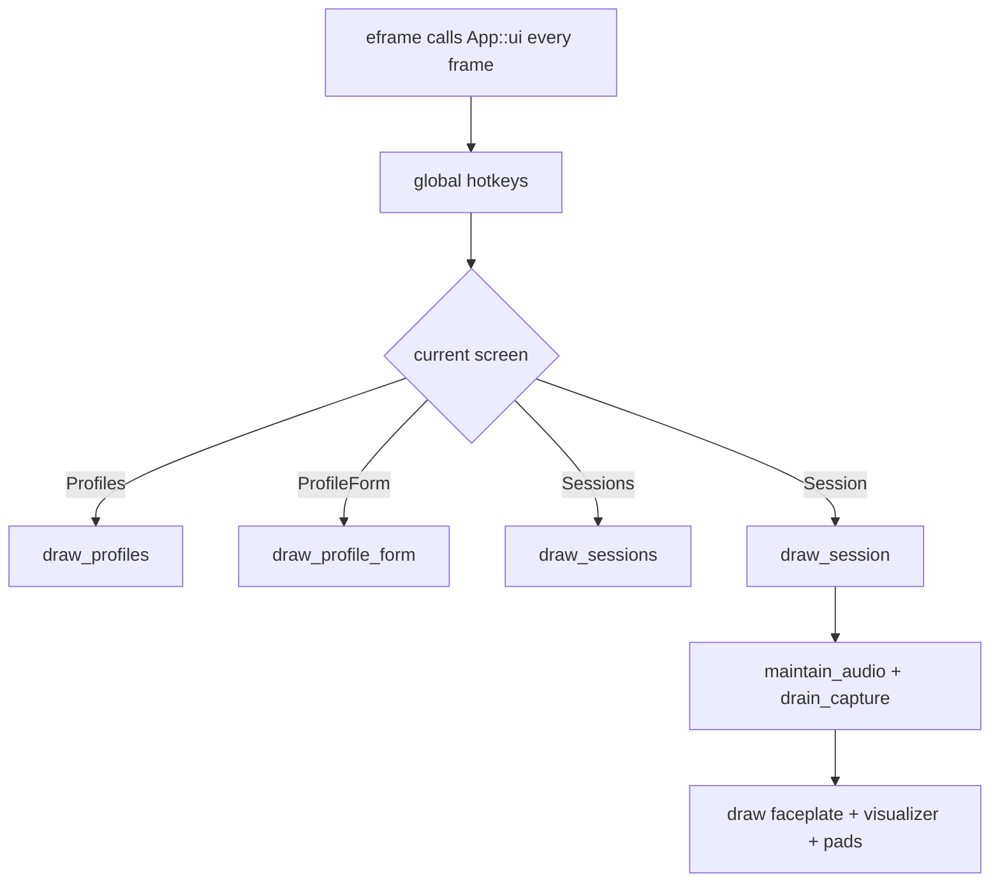
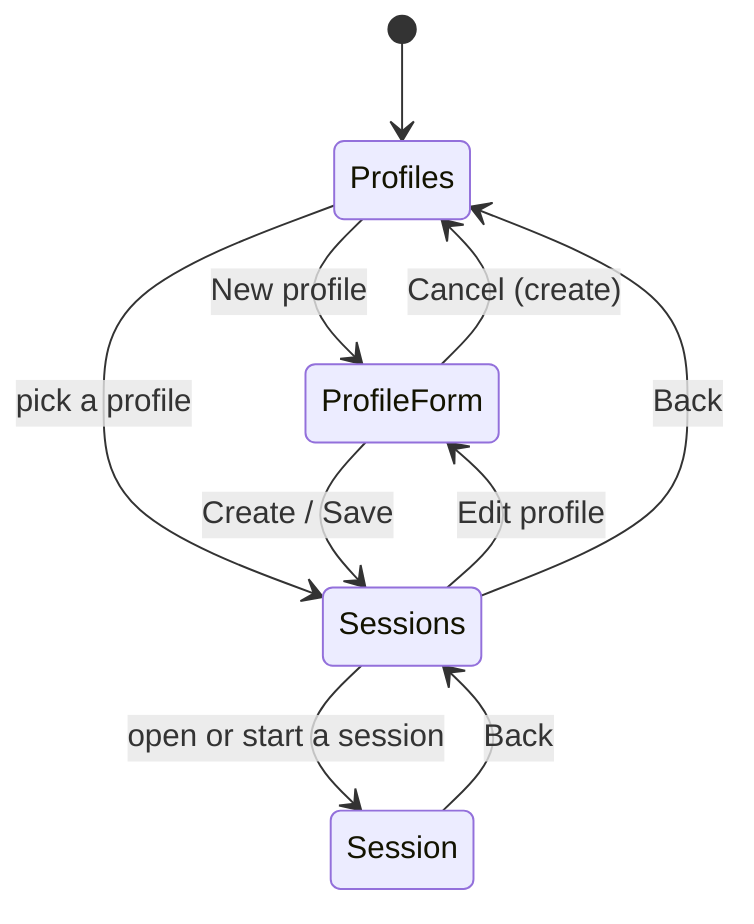
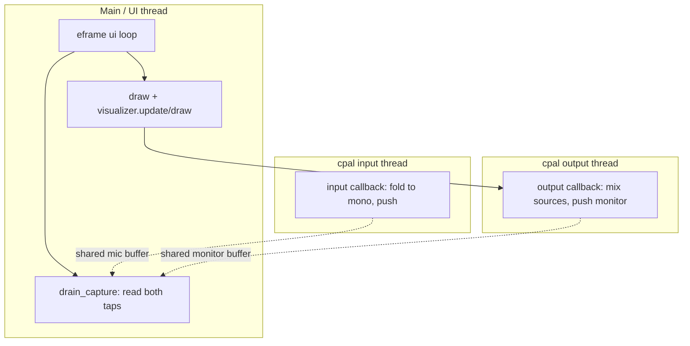

# Architecture

Rondelek is a single-window `eframe` application with **no global state** —
everything is owned by one `App` struct (`src/app.rs`). There is no async runtime
and no message bus; the app is a straightforward immediate-mode loop plus two
audio callback threads owned by `cpal`.

## The per-frame loop

`eframe` calls `App::ui()` once per rendered frame. `App` requests a repaint every
frame, so the loop runs continuously (needed for smooth audio metering and camera
preview). Each frame:

1. Handle global keys (F12 settings, screenshot).
2. Dispatch to the current screen's draw function.
3. On the sampler screen, also pump audio (`maintain_audio`, `drain_capture`).



## Screen state machine

Navigation is a small state machine held in `App.screen` (`AppScreen`). Profiles
and sessions are stored as folders on disk (see [Data model](data-model.md)).



The **profile form is shared** between "new" and "edit" via `FormMode`; the avatar
choice is an `AvatarChoice` (`Keep` / `New(path)` / `Remove`). See
[UI](ui.md) for the form and [Data model](data-model.md) for what it writes.

## Threading model

Three threads, communicating through shared, lock-guarded buffers — never through
channels:



- The **UI thread** owns all state and rendering.
- The **`cpal` input thread** runs the microphone callback: it folds each frame to
  mono and pushes into a shared buffer (`Capture`).
- The **`cpal` output thread** runs the speaker callback: it mixes queued clips and
  pushes the mixed signal into a shared monitor buffer (`Playback`).

The UI thread drains both shared buffers each frame. Locks are held only briefly
inside the callbacks (mirroring each other), which is why the taps use
`Arc<Mutex<VecDeque<f32>>>` rather than channels.

## Module map

```
src/
  main.rs        entry point, window options, RONDELEK_* env overrides
  app.rs         App struct, screen state machine, the per-frame loop, all screens
  audio/         capture, playback, sample (WAV), device enumeration + watchdog
  camera/        desktop webcam capture (nokhwa)
  config/        layout constants, theme, user settings (JSON)
  i18n/          runtime translations, language list, flags, locale detection
  profile/       Profile + profile.json, library root, avatars, session listing
  session/       Session folder model + session.json manifest
  ui/            layout, pad, renderer, visualizer, widgets, panels
  util/          lerp, UID + timestamp helpers
```

For the responsibilities of each dependency, see [Libraries](libraries.md).
