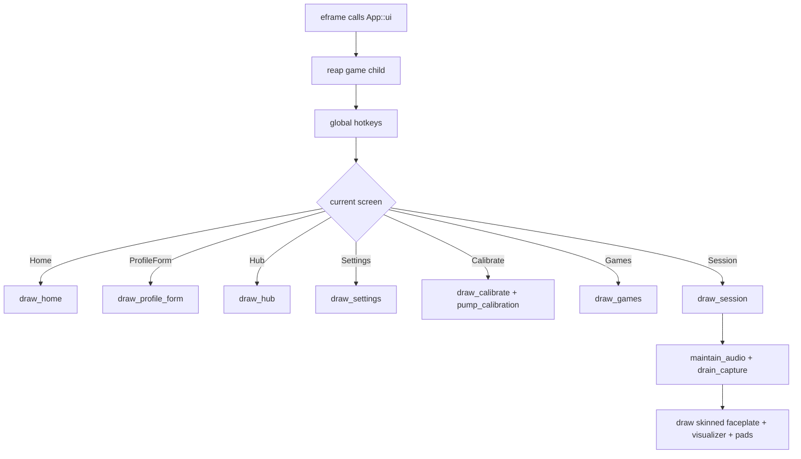
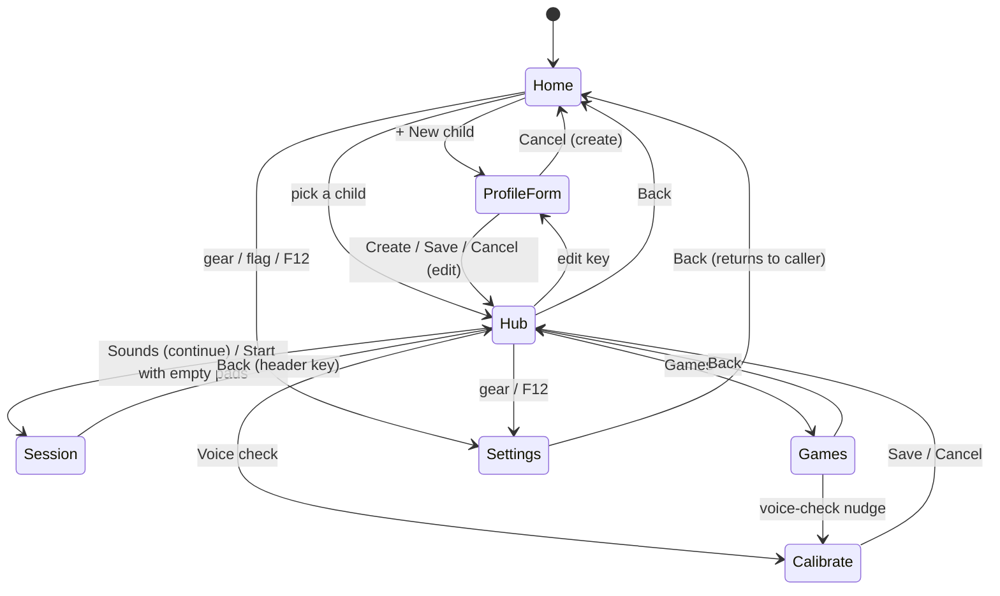
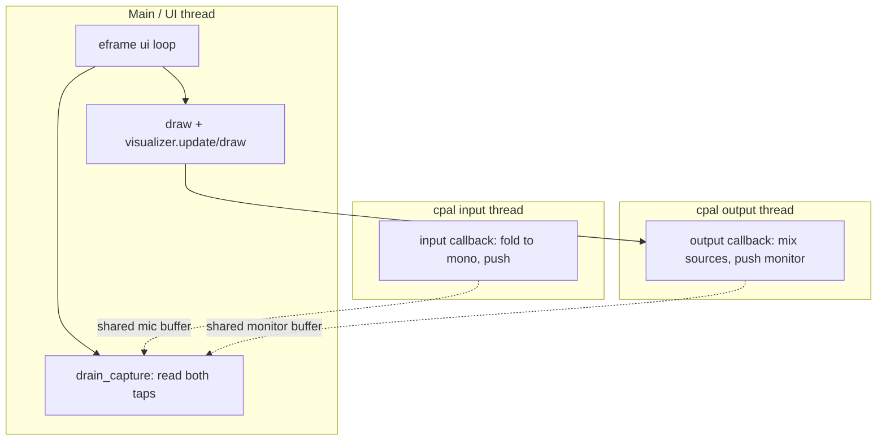

# Architecture

Rondelek is a Cargo workspace of three crates:

| Crate | Path | What it is |
|---|---|---|
| `rondelek-core` | `core/` | GUI-free shared library: audio I/O, vowel detection, settings, profiles, sessions, skin atlas geometry, game registry |
| `rondelek` | `app/` | the `eframe`/`egui` sampler app (plus the `genskin` / `genbanner` generator binaries) |
| `rondelek-game` | `game/` | the raylib voice games, run as a **separate child process** |

The split exists because raylib and the app's windowing stack (eframe/winit on
Windows) both define a `ShowCursor` symbol, and the two cannot be linked into one
Windows executable. `core` must therefore never depend on egui, eframe or raylib.
See `docs/WORKSPACE_SPLIT.md` for the full story.

The app is a single-window `eframe` application with **no global state**:
everything is owned by one `App` struct (`app/src/app/mod.rs`). There is no async
runtime and no message bus. It's a straightforward immediate-mode loop plus the
audio callback threads owned by `cpal`.

## The per-frame loop

`eframe` calls `App::ui()` once per rendered frame. Each frame:

1. Reap a finished game child process (`game_child`).
2. Pick a repaint policy (below).
3. Handle global keys (F12 settings, Ctrl+Shift+S screenshot).
4. Dispatch to the current screen's draw function.


**Repaint policy** (see `docs/PERF.md` for why):

- **Animated screens** (`Session`, `Calibrate`, `Settings` for its live level
  meter, the camera, or the screenshot harness): about 30 fps (`request_repaint_after(33 ms)`).
- **Static screens:** a 100 ms heartbeat. Input events still wake egui immediately.
- **While a game child is running:** no repaint is requested at all. On Wayland, an
  occluded window with a pending repaint busy-spins a whole core. The focus event
  sent when the game window closes wakes the app again.


```mermaid
flowchart TD
    frame[eframe calls App::ui] --> reap[reap game child]
    reap --> keys[global hotkeys]
    keys --> screen{current screen}
    screen -->|Home| p[draw_home]
    screen -->|ProfileForm| f[draw_profile_form]
    screen -->|Hub| s[draw_hub]
    screen -->|Settings| st[draw_settings]
    screen -->|Calibrate| c[draw_calibrate + pump_calibration]
    screen -->|Games| gm[draw_games]
    screen -->|Session| g[draw_session]
    g --> audio[maintain_audio + drain_capture]
    audio --> render[draw skinned faceplate + visualizer + pads]
```

## Screen state machine

Navigation is a small state machine held in `App.screen` (`AppScreen`). Profiles
and sessions are stored as folders on disk (see [Data model](data-model.md)).


```mermaid
stateDiagram-v2
    [*] --> Home
    Home --> ProfileForm: + New child
    Home --> Hub: pick a child
    ProfileForm --> Home: Cancel (create)
    ProfileForm --> Hub: Create / Save / Cancel (edit)
    Hub --> Session: Sounds (continue) / Start with empty pads
    Hub --> Games: Games
    Hub --> Calibrate: Voice check
    Hub --> ProfileForm: edit key
    Hub --> Home: Back
    Calibrate --> Hub: Save / Cancel
    Games --> Calibrate: voice-check nudge
    Games --> Hub: Back
    Session --> Hub: Back (header key)
    Home --> Settings: gear / flag / F12
    Hub --> Settings: gear / F12
    Settings --> Home: Back (returns to caller)
```

- The profile form is shared between "new" and "edit" via `FormMode`. The
  avatar choice is an `AvatarChoice` (`Keep` / `New(path)` / `Character(name)` /
  `Remove`).
- **Settings** is a screen (`AppScreen::Settings`, the "For grown-ups" page).
  `open_settings` remembers the screen it came from in `settings_return`, and can
  scroll straight to a section (the Hub's gear opens the Child card). `F12` toggles
  it from anywhere.
- The Hub has no session list: **Sounds** continues the latest session (or starts
  the first); "Start with empty pads" creates a new one.
- **Games** spawns `rondelek-game <id> --profile <dir>` from the folder the app's
  own exe is in (`spawn_game`). The app drops its `Capture` first so the game can
  open the microphone. Under `cargo run` (detected by the `CARGO` and
  `CARGO_MANIFEST_DIR` env vars), `launch_game` first starts
  `cargo build -p rondelek-game` and `poll_game_build` spawns the game when that
  succeeds. `cargo run` alone would leave a stale game binary.

## Threading model


```mermaid
flowchart TB
    subgraph UI[Main / UI thread]
      loop[eframe ui loop]
      loop --> drain[drain_capture: read both taps]
      loop --> draw[draw + visualizer.update/draw]
    end
    subgraph IN[cpal input thread]
      incb[input callback: fold to mono, push]
    end
    subgraph OUT[cpal output thread]
      outcb[output callback: mix sources, push monitor]
    end
    incb -. shared mic buffer .-> drain
    outcb -. shared monitor buffer .-> drain
    draw --> outcb
```

- The **UI thread** owns all state and rendering.
- The **`cpal` input thread** runs the microphone callback. It folds each frame to
  mono and pushes it into a shared buffer (`Capture`).
- The **`cpal` output thread** runs the speaker callback. It mixes queued clips and
  pushes the mixed signal into a shared monitor buffer (`Playback`).
- The **camera** (`nokhwa`) is polled from the UI thread only while the webcam
  modal is open.
- **Games** are a separate process with their own raylib window and their own cpal
  input stream.

The UI thread drains both shared buffers each frame. The taps are
`Arc<Mutex<VecDeque<f32>>>`, with locks held only briefly. This is a current
implementation choice, **not a rule**: taking a mutex on the real-time audio
thread can glitch under contention. A lock-free SPSC ring buffer (`ringbuf` is
already a dependency, unused) is the better design if audio ever stutters.

## Module map

```
core/src/
  audio/         capture, playback, sample (WAV), device choice, vowel (MFCC)
  config/        settings (JSON), layout constants, theme, skin atlas geometry
  profile/       Profile + profile.json, library root, avatars, calibration, sessions
  session/       Session folder model + session.json manifest
  games.rs       registry of voice games (id + i18n name key)
  util/          lerp, UID + timestamp helpers
app/src/
  main.rs        entry point, window options, --x11, RONDELEK_SIZE
  app/           App struct + state machine (mod.rs), one file per screen
  camera/        desktop webcam capture (nokhwa)
  i18n/          runtime translations, language list, flags
  ui/            shell kit, settings page, characters, skin, layout, pad, renderer,
                 visualizers, level meter, widgets
  bin/           genskin (base skin), genbanner (README banner), genavatars
                 (character placeholders), via pixelart.rs
game/src/
  lib.rs         game run loop + text-free control selection screen
  profile_picker.rs  reusable "who's playing?" screen, shown when started
                 without --profile (double-clicked / standalone)
  runner.rs      Vowel Runner
  voice.rs       mic + vowel detector → per-frame game input
  models.rs      embedded flat-draw GLB props
```

For the responsibilities of each dependency, see [Libraries](libraries.md).
