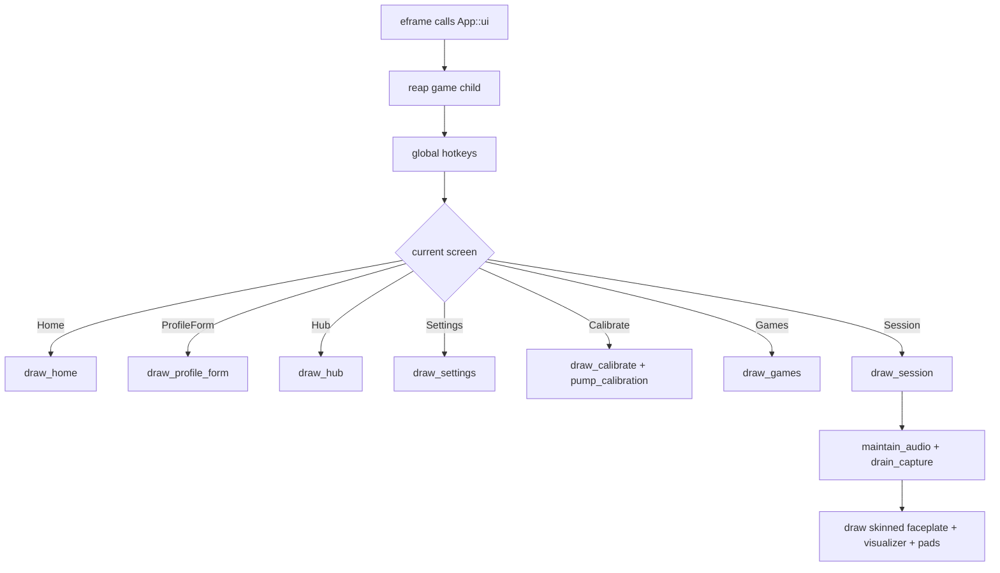
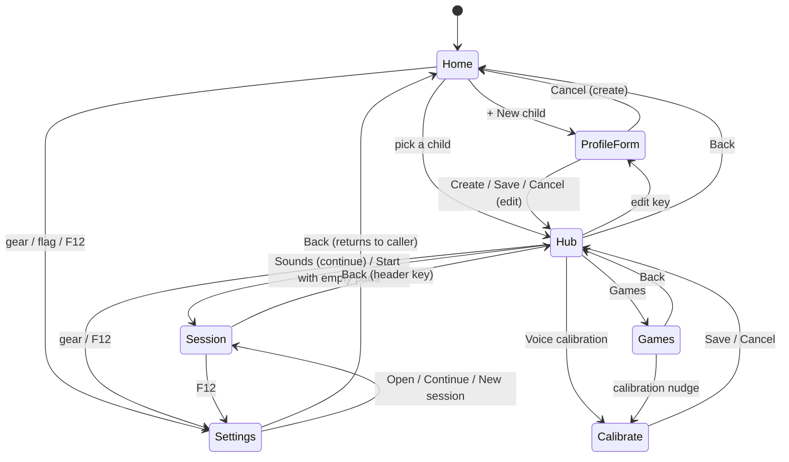
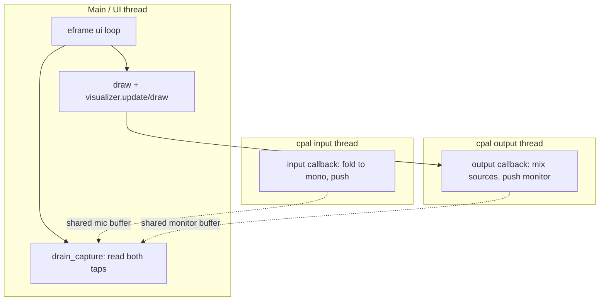

# Architecture

Let's start with the lay of the land. Rondelek is a Cargo workspace with three
crates, each with its own job:

| Crate | Path | What it is |
|---|---|---|
| `rondelek-core` | `core/` | GUI-free shared library: audio I/O, vowel detection, settings, profiles, sessions, skin atlas geometry, game registry |
| `rondelek` | `app/` | the `eframe`/`egui` sampler app (plus the `genskin` / `genarcadeskin` / `genarcade` / `genicon` / `genavatars` / `genpixelpals` generator binaries) |
| `rondelek-game` | `game/` | the raylib voice games, run as a **separate child process** |

Why three and not one? On Windows, raylib and the app's windowing stack
(eframe/winit) both define a `ShowCursor` symbol, and the two simply won't link
into the same executable. So they live apart, and `core` sits in the middle,
shared by both. That's also why `core` must never depend on egui, eframe or
raylib. If you'd like the whole story, it's in `docs/WORKSPACE_SPLIT.md`.

The app itself is a single-window `eframe` application with **no global state**.
Everything belongs to one `App` struct (`app/src/app/mod.rs`). There's no async
runtime and no message bus, just a plain immediate-mode loop plus the audio
callback threads that `cpal` owns. Nice and easy to follow.

## The per-frame loop

`eframe` calls `App::ui()` once for every frame it draws. Each time round, the app:

1. Reaps a finished game child process (`game_child`).
2. Picks a repaint policy (more on that below).
3. Handles the global keys (F12 settings, Ctrl+Shift+S screenshot).
4. Hands over to the current screen's draw function.

**Repaint policy.** The app tries hard to sit quietly when there's nothing to
show (`docs/PERF.md` explains why):

- **Animated screens** (`Session`, `Calibrate`, `Settings` for its live level
  meter, the camera, or the screenshot harness) run at about 30 fps
  (`request_repaint_after(33 ms)`).
- **Static screens** get a gentle 100 ms heartbeat. Input events still wake egui
  straight away.
- **While a game child is running**, no repaint is requested at all. On Wayland,
  an occluded window with a pending repaint busy-spins a whole core, which nobody
  wants. When the game window closes, the focus event wakes the app again.


```mermaid
flowchart TD
    frame[eframe calls App::ui] --> reap[reap game child]
    reap --> keys[global hotkeys]
    keys --> screen{current screen}
    screen -->|Home| p[draw_home]
    screen -->|ProfileForm| f[draw_profile_form]
    screen -->|Hub| s[draw_hub]
    screen -->|Settings| st[draw_settings]
    screen -->|Calibrate| c[draw_calibrate + pump_calibration]
    screen -->|Games| gm[draw_games]
    screen -->|Session| g[draw_session]
    g --> audio[maintain_audio + drain_capture]
    audio --> render[draw skinned faceplate + visualizer + pads]
```

## Screen state machine

Getting around the app is a small state machine, kept in `App.screen`
(`AppScreen`). Profiles and sessions are stored as folders on disk; you'll find
the details in [Data model](data-model.md).


```mermaid
stateDiagram-v2
    [*] --> Home
    Home --> ProfileForm: + New child
    Home --> Hub: pick a child
    ProfileForm --> Home: Cancel (create)
    ProfileForm --> Hub: Create / Save / Cancel (edit)
    Hub --> Session: Sounds (continue) / Start with empty pads
    Hub --> Games: Games
    Hub --> Calibrate: Voice calibration
    Hub --> ProfileForm: edit key
    Hub --> Home: Back
    Calibrate --> Hub: Save / Cancel
    Games --> Calibrate: calibration nudge
    Games --> Hub: Back
    Session --> Hub: Back (header key)
    Home --> Settings: gear / flag / F12
    Hub --> Settings: gear / F12
    Session --> Settings: F12
    Settings --> Home: Back (returns to caller)
    Settings --> Session: Open / Continue / New session
```

A few things worth knowing as you wander through:

- **One form, two jobs.** The profile form handles both "new" and "edit", switched
  by `FormMode`. The avatar choice is an `AvatarChoice` (`Keep` / `New(path)` /
  `Character(name)` / `Remove`).
- **Settings is a screen** (`AppScreen::Settings`, the "For grown-ups" page).
  `open_settings` remembers where you came from in `settings_return`, and it can
  scroll straight to a section (the Hub's gear opens the Profile card). `F12`
  toggles it from anywhere.
- **Kids never browse sessions.** On the Hub, **Sounds** simply carries on with
  the session **used last** (`profile::most_recently_used`: the latest of
  created, recorded into, or opened), or starts the first one. "Start with empty
  pads" makes a fresh one. Grown-ups get the full list on the settings page's
  **Sessions** card and can open any of them. `enter_session` stamps the session
  it opens (`Session::mark_opened`), so Sounds carries on with that one next time.
- **Games** are launched by `spawn_game`, which runs
  `rondelek-game <id> --profile <dir>` from the same folder as the app's own exe.
  The app drops its `Capture` first so the game can have the microphone. Under
  `cargo run` (spotted via the `CARGO` and `CARGO_MANIFEST_DIR` env vars),
  `launch_game` first starts `cargo build -p rondelek-game`, and
  `poll_game_build` spawns the game once that succeeds. Without that step,
  `cargo run` alone would leave you playing a stale game binary.

## Threading model

There aren't many threads, and each one keeps to its own lane:


```mermaid
flowchart TB
    subgraph UI[Main / UI thread]
      loop[eframe ui loop]
      loop --> drain[drain_capture: read both taps]
      loop --> draw[draw + visualizer.update/draw]
    end
    subgraph IN[cpal input thread]
      incb[input callback: fold to mono, push]
    end
    subgraph OUT[cpal output thread]
      outcb[output callback: mix sources, push monitor]
    end
    incb -. shared mic buffer .-> drain
    outcb -. shared monitor buffer .-> drain
    draw --> outcb
```

- The **UI thread** owns all the state and does all the drawing.
- The **`cpal` input thread** runs the microphone callback. It folds each frame to
  mono and pushes it into a shared buffer (`Capture`).
- The **`cpal` output thread** runs the speaker callback. It mixes the queued clips
  and pushes the mixed signal into a shared monitor buffer (`Playback`).
- The **camera** (`nokhwa`) is polled from the UI thread, and only while the webcam
  modal is open.
- **Games** are a separate process, with their own raylib window and their own
  cpal input stream.

Each frame, the UI thread drains both shared buffers. The taps are
`Arc<Mutex<VecDeque<f32>>>`, and the locks are only held for a moment. This is how
things happen to be done today, **not a rule**: taking a mutex on the real-time
audio thread can cause glitches under contention. If audio ever starts to
stutter, a lock-free SPSC ring buffer is the better design (`ringbuf` is already a
dependency, just waiting in the wings, unused).

## Module map

Here's a quick map of where things live:

```
core/src/
  audio/         capture, playback, sample (WAV), device choice, vowel (MFCC)
  config/        settings (JSON), layout constants, theme, skin atlas geometry
  profile/       Profile + profile.json, library root, avatars, calibration, sessions
  session/       Session folder model + session.json manifest
  games.rs       registry of voice games (id + i18n name key)
  util/          lerp, UID + timestamp helpers
app/src/
  main.rs        entry point, window options, --x11, RONDELEK_SIZE
  app/           App struct + state machine (mod.rs), one file per screen
  camera/        desktop webcam capture (nokhwa)
  i18n/          runtime translations, language list, flags
  ui/            shell kit, settings page, characters, skin, layout, pad, renderer,
                 visualizers, level meter, widgets
  bin/           genskin (Classic skin), genarcadeskin (Arcade skin), genarcade
                 (README banner + arcade frames), genicon (app icon), genavatars + genpixelpals
                 (character placeholders), via pixelart.rs
game/src/
  lib.rs         game run loop + text-free control selection screen
  profile_picker.rs  reusable "who's playing?" screen, shown when started
                 without --profile (double-clicked / standalone)
  runner.rs      Vowel Runner
  voice.rs       mic + vowel detector → per-frame game input
  view.rs        what the camera sees: things come and go out of sight
  models.rs      embedded flat-draw GLB props (scenery, the score sun)
  shader_params.rs  shader tuning tables + JSON overrides
  lampula.rs     flat-draw's Lam::pula glass shader, 1:1 (clouds, sun, water)
  bricks.rs      brick models built in code: a grid of colours → one mesh
  props.rs       the meadow, ledges, obstacles and far planes, in bricks
  brick_water.rs the voice-reactive water along the front: glass bricks
  water.rs       the first, smooth toon water (kept: RONDELEK_WATER_STYLE=toon)
```

Curious what each dependency is for? Pop over to [Libraries](libraries.md).
