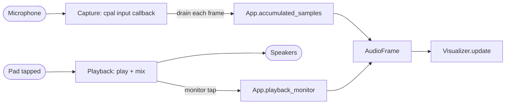
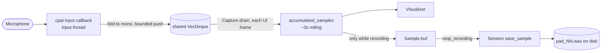
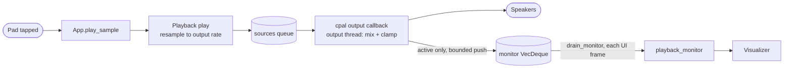
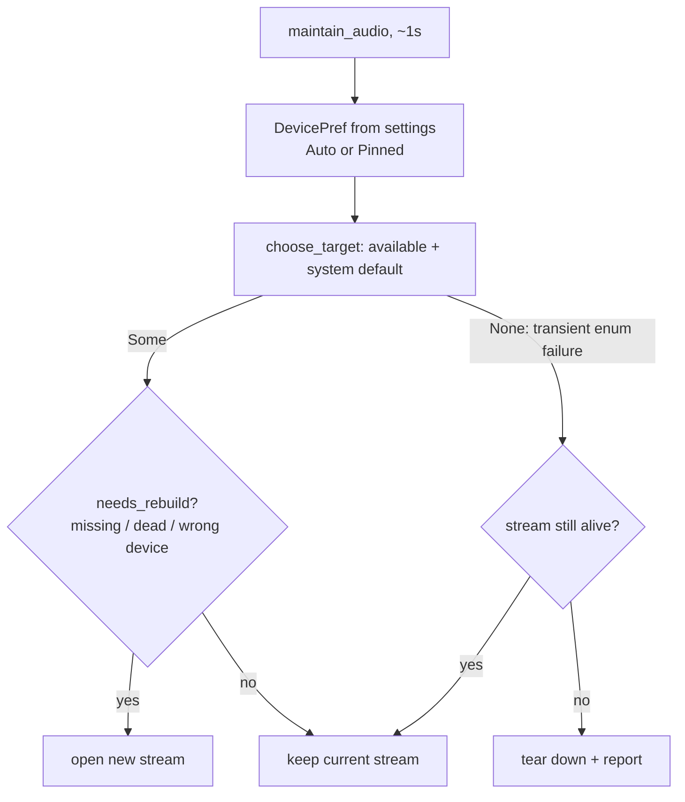
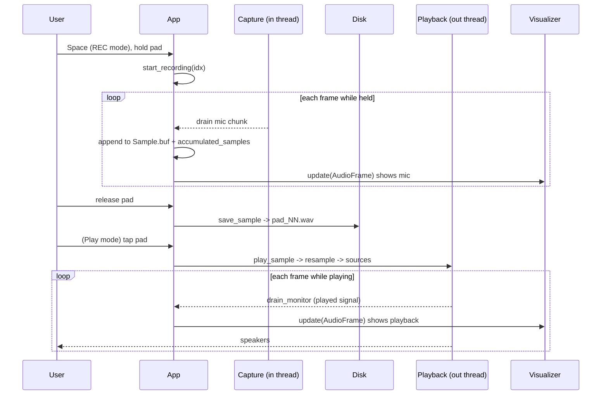

# Audio routing

Audio is **mono end-to-end**. Capture folds every input frame to a single mono
sample; playback duplicates one mono value across all output channels. This keeps
pitch and duration independent of device channel counts.

Everything lives under `src/audio/`:

| File | Responsibility |
|------|----------------|
| `capture.rs` | Microphone input stream (`Capture`); folds to mono, buffers, `drain()`. |
| `playback.rs` | Speaker output stream (`Playback`); mixes clips, resamples, **monitor tap**. |
| `sample.rs` | The in-memory `Sample` buffer and WAV encode/decode (`hound`). |
| `device.rs` | Device enumeration + the pure target/rebuild logic used by the watchdog. |

## The two taps

There are **two** places the UI can read audio from, and the visualizer chooses
between them each frame (see [The visualizer](visualizer.md)):

- **Microphone tap** — the live input, always streaming while a `Capture` exists.
- **Playback monitor tap** — the exact mixed signal sent to the speakers, recorded
  **only while a clip is actually playing**.

## Capture path (microphone)

Key points:

- The input callback (`Capture::open`) folds interleaved channels to mono
  (`fold_to_mono`) and pushes into an `Arc<Mutex<VecDeque<f32>>>`, dropping the
  oldest samples if it overflows.
- `App::drain_capture` pulls the buffer each frame into `accumulated_samples`, a
  rolling window trimmed to ~3 seconds.
- **Recording** appends the *same raw mic chunk* to the target `Sample.buf`. When
  the pad is released (or `Esc`), `stop_recording` writes it to disk via
  `Session::save_sample` → `pad_NN.wav` (`hound`).
- Recording is therefore **independent of the visualizer** — changing anything
  about how the signal is *displayed* cannot alter what is *recorded*.

## Playback path (speakers + monitor tap)

Key points:

- `play_sample` clones the sample buffer and calls `Playback::play`, which
  **resamples** it from the sample's rate to the output device rate
  (`resample_linear`) and pushes it onto the shared `sources` queue.
- The output callback mixes all active sources per frame, averages overlapping
  clips, clamps to `[-1, 1]`, and writes the value to every channel.
- The **monitor tap**: when at least one source is active for a frame, the mixed
  value is also pushed into a monitor `VecDeque`. When nothing is playing, nothing
  is pushed — so the monitor stays empty and the microphone keeps driving the
  display. `drain_monitor()` empties it each UI frame.

## Sample rates

Two independent rates are in play, which is why `AudioFrame` carries both:

- **Capture rate** — the input device's rate (`Capture::sample_rate`), stored as
  `App.capture_rate`. Recorded samples are tagged with it.
- **Output rate** — the output device's rate (`Playback::output_rate`). The monitor
  tap runs at this rate.

`resample_linear` (in `playback.rs`) bridges a sample's stored rate to the output
rate on playback, preserving pitch and duration. It is a simple linear
interpolator and is unit-tested.

## Device management & resilience

A per-frame watchdog, `App::maintain_audio` (throttled to ~1s), keeps both streams
pointed at the right device and rebuilds them when needed. The *decision* logic is
pure and lives in `device.rs` (unit-tested); the *side effects* (opening streams)
live in `app.rs`.

- `DevicePref::from_setting` turns the saved preference into `Auto` (follow system
  default) or `Pinned(name)`.
- `choose_target` picks the device to use given what's available and the current
  system default; `needs_rebuild` decides whether the live stream must be replaced.
- On a **transient enumeration failure** (`choose_target` returns `None`), a healthy
  stream is deliberately kept rather than dropped, so a momentary hiccup doesn't cut
  audio for ~1s. Only an already-dead/absent stream is torn down.
- Device selection is exposed to users in the **Settings panel** (F12); the pinned
  input/output names persist in settings (`serde` default = Auto).

## A full record → play cycle

