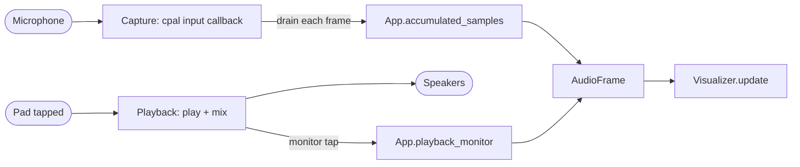
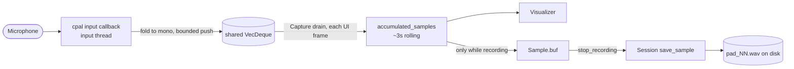
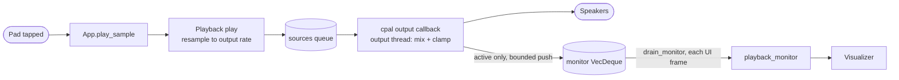
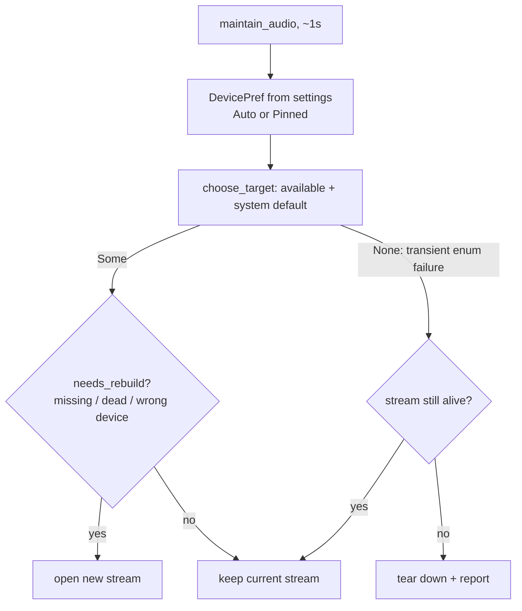
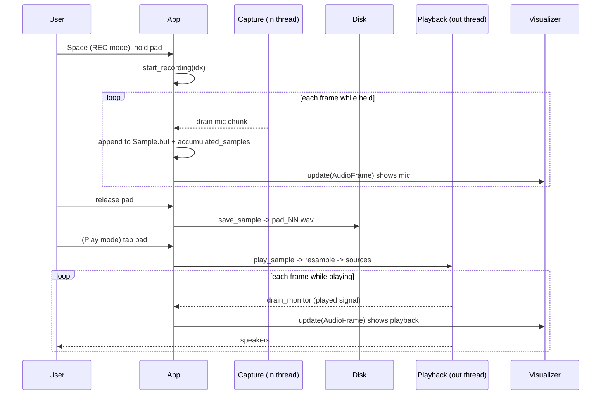

# Audio routing

This is the page about how sound gets in, gets saved, and gets back out again.
The one thing to hold on to: audio is **mono end-to-end**. Capture folds every
input frame down to a single mono sample, and playback copies that one mono value
to every output channel. That way pitch and duration never depend on how many
channels a device happens to have.

Everything lives under `core/src/audio/`, which is GUI-free and shared with the
game:

| File | Responsibility |
|------|----------------|
| `capture.rs` | Microphone input stream (`Capture`); folds to mono, buffers, `drain()`. |
| `playback.rs` | Speaker output stream (`Playback`); mixes clips, resamples, **monitor tap**. |
| `sample.rs` | The in-memory `Sample` buffer and WAV encode/decode (`hound`). |
| `device.rs` | Device enumeration + the pure target/rebuild logic used by the watchdog. |

## The two taps

The UI can listen to audio in **two** places, and the visualizer picks between
them every frame (see [The visualizer](visualizer.md)):

- **Microphone tap**: the live input. It's always streaming while a `Capture`
  exists.
- **Playback monitor tap**: the exact mixed signal going to the speakers. It only
  records **while a clip is actually playing**.

```mermaid
flowchart LR
    mic([Microphone]) --> cap[Capture: cpal input callback]
    cap -->|drain each frame| micbuf[App.accumulated_samples]
    micbuf --> frame[AudioFrame]

    pad([Pad tapped]) --> pb[Playback: play + mix]
    pb --> spk([Speakers])
    pb -->|monitor tap| monbuf[App.playback_monitor]
    monbuf --> frame

    frame --> viz[Visualizer.update]
```

## Capture path (microphone)

Here's the journey from a child's voice to a WAV file on disk:

```mermaid
flowchart LR
    mic([Microphone]) --> cb[cpal input callback<br/>input thread]
    cb -->|fold to mono, bounded push| buf[(shared VecDeque)]
    buf -->|Capture drain, each UI frame| acc[accumulated_samples<br/>~3s rolling]
    acc --> viz[Visualizer]
    acc -->|only while recording| samp[Sample.buf]
    samp -->|stop_recording| save[Session save_sample]
    save --> wav[(pad_NN.wav on disk)]
```

Step by step:

- The input callback (`Capture::open`) folds interleaved channels to mono
  (`fold_to_mono`) and pushes them into an `Arc<Mutex<VecDeque<f32>>>`. If that
  overflows, the oldest samples are dropped.
- Each frame, `App::drain_capture` pulls the buffer into `accumulated_samples`, a
  rolling window trimmed to about 3 seconds.
- **Recording** appends the *same raw mic chunk* to the target `Sample.buf`. When
  the pad is released (or `Esc` is pressed), `stop_recording` writes it to disk
  through `Session::save_sample` → `pad_NN.wav` (`hound`).
- So recording is **independent of the visualizer**. You can change anything about
  how the signal is *displayed* without any risk to what gets *recorded*.

## Playback path (speakers + monitor tap)

And here's the way back out, when a child taps a pad to hear it:

```mermaid
flowchart LR
    pad([Pad tapped]) --> ps[App.play_sample]
    ps --> play[Playback play<br/>resample to output rate]
    play --> src[(sources queue)]
    src --> cb[cpal output callback<br/>output thread: mix + clamp]
    cb --> spk([Speakers])
    cb -->|active only, bounded push| mon[(monitor VecDeque)]
    mon -->|drain_monitor, each UI frame| pm[playback_monitor]
    pm --> viz[Visualizer]
```

Step by step:

- `play_sample` clones the sample buffer and calls `Playback::play`. That
  **resamples** it from the sample's own rate to the output device's rate
  (`resample_linear`) and pushes it onto the shared `sources` queue.
- The output callback mixes all active sources for each frame, averages
  overlapping clips, clamps to `[-1, 1]`, and writes the result to every channel.
- **The monitor tap.** Whenever at least one source is active for a frame, the
  mixed value is also pushed into a monitor `VecDeque`. When nothing is playing,
  nothing is pushed, so the monitor stays empty and the microphone gets to drive
  the display. `drain_monitor()` empties it each UI frame.
- **Clearing on stop.** The app keeps a short rolling `playback_monitor` window to
  feed the visualizer's FFT. As soon as `Playback::is_playing()` says there are no
  queued clips left, `drain_capture` **clears** that window. Otherwise the tail of
  a finished clip would sit frozen on the display and drown out a quiet
  microphone. (The tap only ever gains *new* samples while something is playing,
  so it would never age out by itself.) `is_playing()` reads the `sources` queue,
  so it flips off the instant the last clip has been fully read, whatever the frame
  rate or audio buffer size.

## Sample rates

There are two separate rates in play, which is why `AudioFrame` carries both:

- **Capture rate**: the input device's rate (`Capture::sample_rate`), kept as
  `App.capture_rate`. Recorded samples are tagged with it.
- **Output rate**: the output device's rate (`Playback::output_rate`). The monitor
  tap runs at this rate.

`resample_linear` (in `playback.rs`) bridges the gap on playback, taking a sample
from its stored rate to the output rate while keeping pitch and duration just as
they were. It's a simple linear interpolator, and it's unit-tested.

## Device management & resilience

Microphones get unplugged and headphones come and go, so a small per-frame
watchdog keeps an eye on things. `App::maintain_audio` (throttled to about once a
second) keeps both streams pointed at the right device and rebuilds them when
needed. The *decision* logic is pure and lives in `device.rs`, where it's
unit-tested. The *side effects* (actually opening streams) live in the app, in
`app/src/app/mod.rs`.

```mermaid
flowchart TD
    tick[maintain_audio, ~1s] --> pref[DevicePref from settings<br/>Auto or Pinned]
    pref --> target[choose_target: available + system default]
    target -->|Some| need{needs_rebuild?<br/>missing / dead / wrong device}
    need -->|yes| build[open new stream]
    need -->|no| keep[keep current stream]
    target -->|None: transient enum failure| alive{stream still alive?}
    alive -->|yes| keep
    alive -->|no| drop[tear down + report]
```

- `DevicePref::from_setting` turns the saved preference into `Auto` (follow the
  system default) or `Pinned(name)`.
- `choose_target` picks the device to use, given what's available and what the
  system default is right now. `needs_rebuild` decides whether the live stream has
  to be replaced.
- If enumeration fails for a moment (`choose_target` returns `None`), a healthy
  stream is deliberately kept rather than dropped, so a brief hiccup doesn't cut
  the sound for a second. Only a stream that's already dead or missing is torn
  down.
- Grown-ups choose devices on the settings page (F12), in the **Sound** card. The
  pinned input/output names are saved in settings (`serde` default = Auto).

## A full record → play cycle

To tie it all together, here's one complete round trip, from holding a pad to
hearing it played back:

```mermaid
sequenceDiagram
    participant U as User
    participant App
    participant Cap as Capture (in thread)
    participant Disk
    participant Pb as Playback (out thread)
    participant Viz as Visualizer

    U->>App: Space (REC mode), hold pad
    App->>App: start_recording(idx)
    loop each frame while held
        Cap-->>App: drain mic chunk
        App->>App: append to Sample.buf + accumulated_samples
        App->>Viz: update(AudioFrame) shows mic
    end
    U->>App: release pad
    App->>Disk: save_sample -> pad_NN.wav
    U->>App: (Play mode) tap pad
    App->>Pb: play_sample -> resample -> sources
    loop each frame while playing
        Pb-->>App: drain_monitor (played signal)
        App->>Viz: update(AudioFrame) shows playback
        Pb-->>U: speakers
    end
```
