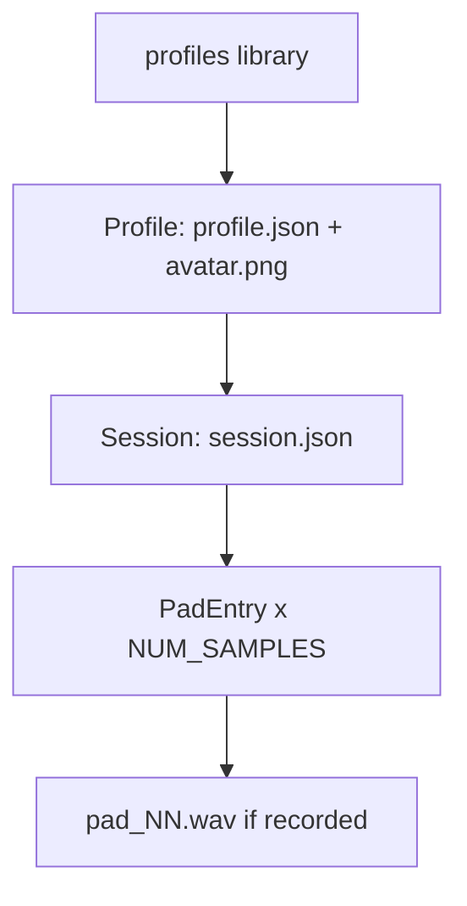

# Data model & storage

Rondelek keeps everything as **plain files** that belong to the user. There's no
database and no network, just folders you can open and look inside. There are
two roots, and both are found through the `dirs` crate.

## The profile library

The library lives under the OS **data** directory (`dirs::data_dir()`). On macOS,
for example, that's `~/Library/Application Support/rondelek/profiles/`:

```
profiles/
  <slug>-<short-uid>/            one child
    profile.json                 { uid, name, avatar, character?, created }
    avatar.png                   optional photo, square, 256px
    calibration.json             optional, per-child vowel calibration
    sessions/
      2026-07-01_22-11-06/       one practice run (timestamped folder)
        session.json             { uid, name, created, modified, last_opened, pads[] }
        pad_01.wav               a recorded sample (mono, device rate)
        pad_05.wav
        ...
```

A few house rules:

- **Folder names never use the child's raw name.** A profile's folder is
  `<slug>-<short-uid>` (`profile::slug` plus a short UID), and sessions are named
  by their timestamp. The display name only lives inside the manifest, so
  renaming a profile does **not** rename its folder.
- Profiles and sessions both carry a stable **`uid`**, ready for cross-referencing
  later on (notes, search).
- Avatars are always stored square. Any uploaded or captured image is
  centre-cropped and resized to 256px (`profile::square_avatar`).
- Instead of a photo, a child can pick a built-in **character**. `character` holds
  its name (e.g. `"fox"`; see `rondelek_core::characters`). A photo and a
  character replace each other. The field is optional and left out when unset, so
  older manifests and older app versions carry on happily.
- **Deleting** a profile (from the settings page) calls `Profile::move_to_trash`.
  The whole folder moves to `profiles/.trash/<folder>-<unix secs>/`, which
  `list_profiles` ignores. Nothing is actually erased, so if a profile was deleted
  by mistake, moving the folder back puts everything right.


```mermaid
flowchart TD
    lib[profiles library] --> prof[Profile: profile.json + avatar.png]
    prof --> sess[Session: session.json]
    sess --> pad[PadEntry x NUM_SAMPLES]
    pad --> wav[pad_NN.wav if recorded]
```

### Calibration

`calibration.json` (`vowel::VowelCalibration`) is written once a child finishes a
voice calibration. It holds:

- six **MFCC templates** (`mean` + `var` per vowel, indexed like `vowel::VOWELS`),
- the `channel_mean` (the mic estimate removed from every template),
- `n_mfcc`, `sample_rate` and `min_vowel_rms` (the adaptive voicing gate),
- the `input_device` that was used,
- a format `version`, and `created`.

If the file is missing, or has an older `version` (such as the pre-MFCC formant
format), it reads as "not calibrated" and the child is simply asked to calibrate
again. For how it's built, see
[The visualizer → Calibration](visualizer.md#calibration).

### Manifests

- **`profile.json`** (`profile::ProfileManifest`): `uid`, `name` (the sanitised
  display name), `avatar` (the photo's filename, or none), `character` (an
  optional built-in avatar name) and `created`.
- **`session.json`** (`session::SessionManifest`): `uid`, `name`, `created`,
  `modified` (the last recording), `last_opened` (the last time it was opened in
  the sampler; `0` or absent in manifests from before it existed), and a `pads`
  vector of `PadEntry { label, file, has_sample }`, always normalised to exactly
  `NUM_SAMPLES` entries. All times are Unix seconds (UTC); the UI shows them in
  local time.
- `Profile::list_sessions` reads each manifest field by field (so a broken one
  still shows up) into a `SessionInfo`, newest created first, along with a count
  of recorded pads. Note that the session **Sounds** carries on with is the one
  most recently *used* (`profile::most_recently_used`, the latest of `created` /
  `modified` / `last_opened`), not simply the newest.

Both manifests are written with `serde_json` pretty-printing. Missing or legacy
fields fall back to `serde` defaults, so older manifests keep loading just fine.

## Settings

Settings live under the OS **config** directory (`dirs::config_dir()`); on macOS
that's `~/Library/Application Support/rondelek/settings.json`. It's a single
`config::Settings` document holding:

- the volume,
- the active `skin` (`null` = the default, Arcade; `"base"` = Classic; anything
  else is an installed skin's folder name),
- the visualizer knobs (`visualizer_smoothing` / `_decay` / `_num_bars` /
  `_floor_db`),
- the vowel-detection knobs (`vowel_voicing_threshold` / `_smoothing` /
  `_show_threshold` / `_margin_threshold` / `vowel_steady`),
- the `active_visualizer` index, `game_reaction`, the UI `language`,
- and the pinned `input_device` / `output_device` names.

This file already exists on people's machines, so loading it is deliberately
forgiving (`Settings::load_from`):

- `Settings` has a container-level `#[serde(default)]`, so any **missing** field
  takes its value from `Settings::default()`.
- If the file doesn't parse as it is (say, one field has the wrong type), it's
  first **copied to `settings.broken-<unix secs>.json`**. Then every field that
  still deserializes is kept, and only the bad ones fall back to defaults. A file
  that isn't JSON at all gives you defaults, with the original safe in the backup.
- **Saves are atomic**: write a temp file, then rename it over `settings.json`.

**Two processes write this file.** The game owns `game_reaction`: it reloads the
file, changes only that one field, and saves. When the app reaps the finished
game child, it picks up `game_reaction` from disk, so its next save doesn't write
back a stale value.

The guard test `current_settings_file_loads_unchanged` parses a complete
present-day file (`core/tests/fixtures/settings-2026-09.json`). Please never
remove or retype a field without a migration and a test that parses the old
shape, and rename fields with `#[serde(alias = "old_name")]`.

## What is embedded vs on disk

| Embedded in the binary | On disk (user-owned) |
|------------------------|----------------------|
| Fonts, translations, picker flags | Profiles, sessions, recordings (WAV) |
| Base skin, game shaders, 3D models (GLB), character avatars | User settings (JSON), user skins |
| Pad identities, theme defaults, layout constants (Rust source) | Per-child calibration |
