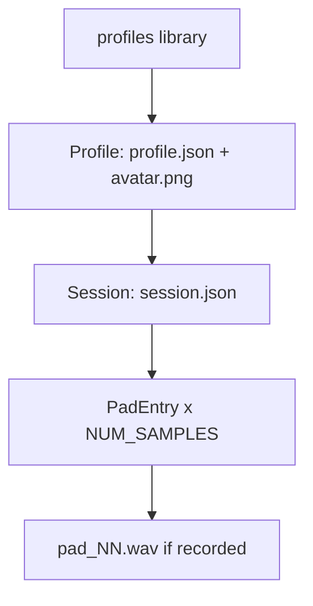

# Data model & storage

Rondelek stores everything as **plain files** the user owns — no database, no
network. There are two roots, both resolved via the `dirs` crate.

## The profile library

Under the OS **data** directory (`dirs::data_dir()`), e.g. on macOS
`~/Library/Application Support/rondelek/profiles/`:

```
profiles/
  <slug>-<short-uid>/            one child
    profile.json                 { uid, name, avatar, created }
    avatar.png                   optional, square, 256px
    calibration.json             optional, per-child vowel calibration
    sessions/
      2026-07-01_22-11-06/       one practice run (timestamped folder)
        session.json             { uid, name, created, modified, pads[] }
        pad_01.wav               a recorded sample (mono, device rate)
        pad_05.wav
        ...
```

- **Folder names never use the raw child name.** The profile folder is
  `<slug>-<short-uid>` (`profile::slug` + a short UID); sessions are timestamped.
  The display name lives only in the manifest, so renaming a profile does **not**
  rename its folder.
- Both profiles and sessions carry a stable **`uid`** for future cross-referencing
  (notes, search).
- Avatars are always stored square: any uploaded or captured image is centre-cropped
  and resized to 256px (`profile::square_avatar`).


```mermaid
flowchart TD
    lib[profiles library] --> prof[Profile: profile.json + avatar.png]
    prof --> sess[Session: session.json]
    sess --> pad[PadEntry x NUM_SAMPLES]
    pad --> wav[pad_NN.wav if recorded]
```

### Calibration

`calibration.json` (`vowel::VowelCalibration`, written after a child runs voice
calibration) holds six **MFCC templates** (`mean` + `var` per vowel, indexed like
`vowel::VOWELS`), the `channel_mean` (mic estimate removed from every template),
`n_mfcc`, `sample_rate`, `min_vowel_rms` (adaptive voicing gate), the
`input_device` used, a format `version`, and `created`.
Absent or an older `version` (e.g. the pre-MFCC formant format) reads as "not
calibrated" — the child is asked to recalibrate. See
[The visualizer → Calibration](visualizer.md#calibration).

### Manifests

- **`profile.json`** (`profile::ProfileManifest`): `uid`, `name` (sanitised
  display name), `avatar` (filename or none), `created`.
- **`session.json`** (`session::SessionManifest`): `uid`, `name`, `created`,
  `modified`, and a `pads` vector of `PadEntry { label, file, has_sample }`, always
  normalised to exactly `NUM_SAMPLES` entries.

Both are written with `serde_json` pretty-printing. Missing/legacy fields fall back
to `serde` defaults so older manifests keep loading.

## Settings

Under the OS **config** directory (`dirs::config_dir()`), e.g.
`~/Library/Application Support/rondelek/settings.json` — a single
`config::Settings` document: volume, the active `skin`, the visualizer knobs
(`visualizer_smoothing` / `_decay` / `_num_bars` / `_floor_db`), the
vowel-detection knobs (`vowel_voicing_threshold` / `_smoothing` /
`_show_threshold` / `_margin_threshold` / `vowel_steady`), the
`active_visualizer` index, `game_reaction`, UI `language`, and pinned
`input_device` / `output_device` names.

Fields added after the first release use `#[serde(default = "...")]`, so older
files keep loading. Be aware of the current sharp edges:

- The original fields (`volume`, `visualizer_smoothing`, `visualizer_decay`,
  `visualizer_num_bars`) have **no** serde default. A file missing one of them
  fails to parse.
- On **any** parse error, `Settings::load` silently **overwrites** `settings.json`
  with defaults, losing pinned devices, skin and language.
- **Two processes write the file.** The game saves `game_reaction` (reload,
  modify, save), but the app loads settings only once in `App::new` and saves its
  in-memory copy later (on any settings change and in `on_exit`), which overwrites
  the game's value. Writes are not atomic (`std::fs::write`).

Never remove or retype a field without a migration and a test that parses the old
shape.

## What is embedded vs on disk

| Embedded in the binary | On disk (user-owned) |
|------------------------|----------------------|
| Fonts, translations, picker flags | Profiles, sessions, recordings (WAV) |
| Base skin, game shaders, 3D models (GLB) | User settings (JSON), user skins |
| Pad identities, theme defaults, layout constants (Rust source) | Per-child calibration |
