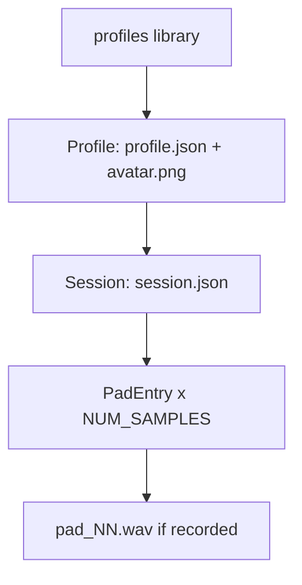

# Data model & storage

Rondelek stores everything as **plain files** the user owns — no database, no
network. There are two roots, both resolved via the `dirs` crate.

## The profile library

Under the OS **data** directory (`dirs::data_dir()`), e.g. on macOS
`~/Library/Application Support/rondelek/profiles/`:

```
profiles/
  <slug>-<short-uid>/            one child
    profile.json                 { uid, name, avatar, character?, created }
    avatar.png                   optional photo, square, 256px
    calibration.json             optional, per-child vowel calibration
    sessions/
      2026-07-01_22-11-06/       one practice run (timestamped folder)
        session.json             { uid, name, created, modified, last_opened, pads[] }
        pad_01.wav               a recorded sample (mono, device rate)
        pad_05.wav
        ...
```

- **Folder names never use the raw child name.** The profile folder is
  `<slug>-<short-uid>` (`profile::slug` + a short UID); sessions are timestamped.
  The display name lives only in the manifest, so renaming a profile does **not**
  rename its folder.
- Both profiles and sessions carry a stable **`uid`** for future cross-referencing
  (notes, search).
- Avatars are always stored square: any uploaded or captured image is centre-cropped
  and resized to 256px (`profile::square_avatar`).
- Instead of a photo, a child can use a built-in **character**: `character` holds
  its name (e.g. `"fox"`, see `rondelek_core::characters`). A photo and a character replace
  each other. The field is optional and omitted when unset, so older manifests
  and older app versions are unaffected.
- **Deleting** a child (settings page) calls `Profile::move_to_trash`. The whole
  folder moves to `profiles/.trash/<folder>-<unix secs>/`, which `list_profiles`
  ignores. Nothing is erased, so a mistake can be undone by moving it back.


```mermaid
flowchart TD
    lib[profiles library] --> prof[Profile: profile.json + avatar.png]
    prof --> sess[Session: session.json]
    sess --> pad[PadEntry x NUM_SAMPLES]
    pad --> wav[pad_NN.wav if recorded]
```

### Calibration

`calibration.json` (`vowel::VowelCalibration`, written after a child runs voice
calibration) holds six **MFCC templates** (`mean` + `var` per vowel, indexed like
`vowel::VOWELS`), the `channel_mean` (mic estimate removed from every template),
`n_mfcc`, `sample_rate`, `min_vowel_rms` (adaptive voicing gate), the
`input_device` used, a format `version`, and `created`.
Absent or an older `version` (e.g. the pre-MFCC formant format) reads as "not
calibrated" — the child is asked to recalibrate. See
[The visualizer → Calibration](visualizer.md#calibration).

### Manifests

- **`profile.json`** (`profile::ProfileManifest`): `uid`, `name` (sanitised
  display name), `avatar` (photo filename or none), `character` (optional
  built-in avatar name), `created`.
- **`session.json`** (`session::SessionManifest`): `uid`, `name`, `created`,
  `modified` (last recording), `last_opened` (last time it was opened in the
  sampler; `0`/absent in manifests from before it existed), and a `pads` vector
  of `PadEntry { label, file, has_sample }`, always normalised to exactly
  `NUM_SAMPLES` entries. All times are Unix seconds (UTC); the UI shows them in
  local time.
- `Profile::list_sessions` reads every manifest field by field (a broken one
  still lists) into a `SessionInfo`, newest created first, with a count of
  recorded pads. The session **Sounds** continues is the most recently *used*
  one (`profile::most_recently_used`, the latest of `created` / `modified` /
  `last_opened`), not simply the newest.

Both are written with `serde_json` pretty-printing. Missing/legacy fields fall back
to `serde` defaults so older manifests keep loading.

## Settings

Under the OS **config** directory (`dirs::config_dir()`), e.g.
`~/Library/Application Support/rondelek/settings.json` — a single
`config::Settings` document: volume, the active `skin` (`null` = the default,
Arcade; `"base"` = Classic; else an installed skin's folder name), the visualizer knobs
(`visualizer_smoothing` / `_decay` / `_num_bars` / `_floor_db`), the
vowel-detection knobs (`vowel_voicing_threshold` / `_smoothing` /
`_show_threshold` / `_margin_threshold` / `vowel_steady`), the
`active_visualizer` index, `game_reaction`, UI `language`, and pinned
`input_device` / `output_device` names.

This file already exists on users' machines, so loading is deliberately forgiving
(`Settings::load_from`):

- `Settings` has a container-level `#[serde(default)]`: any **missing** field
  takes its value from `Settings::default()`.
- If the file doesn't parse as-is (e.g. one field has the wrong type), it is first
  **copied to `settings.broken-<unix secs>.json`**. Then every field that still
  deserializes is kept and only the bad ones fall back to defaults. A file that
  isn't JSON at all yields defaults, with the original still in the backup.
- **Saves are atomic**: write a temp file, then rename it over `settings.json`.

**Two processes write the file.** The game owns `game_reaction`: it reloads the
file, changes only that field, and saves. When the app reaps the finished game
child, it adopts `game_reaction` from disk, so its next save doesn't write back a
stale value.

The guard test `current_settings_file_loads_unchanged` parses a complete
present-day file (`core/tests/fixtures/settings-2026-09.json`). Never remove or
retype a field without a migration and a test that parses the old shape; rename
with `#[serde(alias = "old_name")]`.

## What is embedded vs on disk

| Embedded in the binary | On disk (user-owned) |
|------------------------|----------------------|
| Fonts, translations, picker flags | Profiles, sessions, recordings (WAV) |
| Base skin, game shaders, 3D models (GLB), character avatars | User settings (JSON), user skins |
| Pad identities, theme defaults, layout constants (Rust source) | Per-child calibration |
