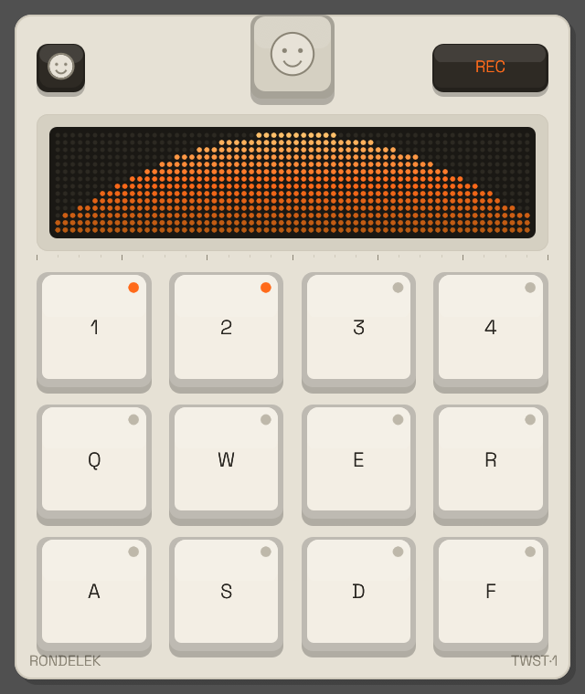

# Rondelek TWST-1 — Developer Handbook

Rondelek TWST-1 is a desktop **audio sampler for children with hearing implants**:
record short sounds onto pads and play them back, turning speech and hearing
practice into a game. One installation serves many children through a library of
**profiles**, each holding **sessions** of recordings on disk.

  

This handbook is for people **working on** Rondelek — how the pieces fit together,
especially the audio routing and the rendering. If you just want to build and run
the app, start with the repository [`README`](https://github.com/pipejesus/rondelek-twst-1#readme).

## Tech stack at a glance

- **Language:** Rust (edition 2024).
- **GUI:** [`egui`](https://github.com/emilk/egui) / `eframe` — immediate-mode, redrawn every frame.
- **Audio:** [`cpal`](https://github.com/RustAudio/cpal) for capture + playback, `hound` for WAV, `rustfft` for the spectrum.
- **Camera:** [`nokhwa`](https://github.com/l1npengtul/nokhwa) (desktop) for avatar capture.
- **Persistence:** plain JSON files (`serde`) under the OS data/config directories — no database, no network.

## How to read this

| Chapter | What it covers |
|---------|----------------|
| [Architecture](architecture.md) | The `App` struct, the per-frame loop, the screen state machine, threading. |
| [Audio routing](audio.md) | **The essential one.** Capture, playback, the visualizer taps, device management. |
| [The visualizer](visualizer.md) | The pluggable `Visualizer` trait and the spectrum DSP pipeline. |
| [UI, layout & rendering](ui.md) | The fluid faceplate layout, the renderer, theming, fonts, i18n. |
| [Data model & storage](data-model.md) | What lives on disk and how it's laid out. |
| [Libraries](libraries.md) | Every dependency and why it's here. |

> **Keeping this current:** these docs are treated as part of the code. See
> [Contributing to these docs](contributing.md) — the rule is that any change to
> behaviour or wiring updates the relevant page in the same commit.
