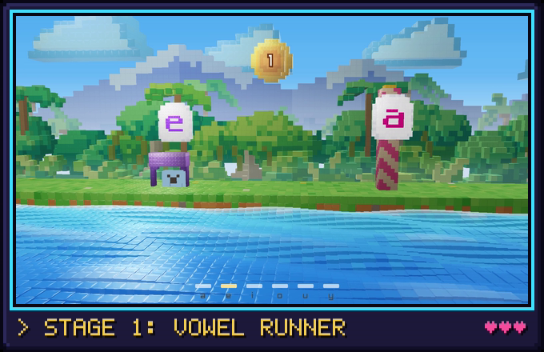

# The games

The games are Rondelek's second way to play, and here the child's voice is the
controller. No buttons, no joystick: just say a vowel, and something happens
on screen.

  

The games need the [voice calibration](voice-calibration.md), so they know what
your child's vowels sound like. If it isn't done yet, the Games screen shows a
friendly reminder with a key that takes you straight there.

## Vowel Runner

The first game is **Vowel Runner**. A little blocky hero runs along a meadow by
the sea, in front of a thick jungle of trees, palms and big leaves under tall
snowy mountains, and things come
their way: blocks to jump over, bars to duck under,
brick walls to knock down with a star, and tall pillars that need a double
jump. Your child says one vowel to **jump** (say it again in mid-air for a
flying double jump), another to **duck**, and a third to **throw a star**.

Every obstacle comes with a little white stone tablet, the vowel that gets
past it carved right in. The tablets listen too: when your child says a
tablet's vowel, it gives a happy hop, and its letter lights up for as long as
the sound goes on.

A miss is no drama: the hero just bounces off and keeps running. Every
obstacle cleared the way it asks earns a point, and the golden sun at the top
spins round like a coin to show the new score. (Leaping over a bar or a wall
gets past it, but only ducking under the bar or knocking the wall down with a
star counts, so every vowel gets its turn.)

Now and then grassy ledges float by with little golden suns over them. Jump up
onto a ledge (right through it from below is fine) and run along it to collect
the suns: each one is a point too. The high ledges need the double jump, or a
hop up from a low ledge just before them.

When a sound comes out, the sea along the front gets playful too: its waves
dance while the child makes noise. The scenery itself stays calm and slow on
purpose, so nothing competes with the hero or makes anyone dizzy.

## Before each game: the grown-up's screen

Every game starts on a small setup screen. It has no words at all, just
pictures, so it works in any language:

- **Which vowel does what.** For each move (▲ jump, ▼ duck, ★ throw a star),
  pick a vowel. Choose sounds your child can say comfortably, or sounds you'd
  like to practise.
- **Which obstacles appear.** Switch obstacle kinds on or off. Fewer kinds
  make an easier, gentler game.
- **Reaction** (the turtle and the rabbit). Towards the turtle, the game waits
  a moment to be sure it heard right, and makes fewer mistakes. Towards the
  rabbit, it reacts at once. The game remembers this for next time, and you'll
  find the same setting on the grown-ups page.

Press **▶** to play.

A nice detail: the game then listens **only for the vowels you picked**. So if,
say, *e* and *y* sound alike for your child, and you only picked *e*, the game
won't get confused by a *y*.

## While playing

- Press `Esc` to end the game. You're taken straight back to the app.
- The keys `A E I O U Y` act like saying that vowel. They're handy for a grown-up
  trying the game out, or for checking which vowel does what.

While a game is running, Rondelek itself steps quietly aside and hands the
microphone over to the game, so nothing gets in the way.

## Starting a game on its own

The games also run without the main app. On Windows, double-click
**`rondelek-game.exe`**. On Linux, run the AppImage with `--game` (the menu
entry has a *Voice games* shortcut, too). The game first asks
**who's playing**, showing the same children and pictures as the app, and then
off you go.

## More games are coming

Vowel Runner is the first of several. New games plug into the same setup:
the same children, the same calibration, the same who's-playing screen. If you
build things, [Voice games](games.md) under the hood shows how a game is made.
