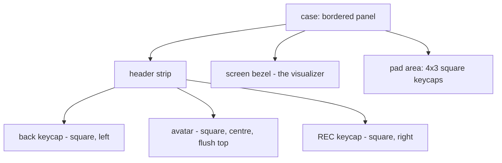

# UI, layout & rendering

The UI is [`egui`](https://github.com/emilk/egui) / `eframe`, immediate-mode: there
are no retained widget objects for the sampler — every frame recomputes geometry
from the live window rectangle and paints. This makes the faceplate reflow fluidly
on resize with no fixed pixel grid.

## Fluid faceplate layout

`ui/layout.rs::compute` takes the available `Rect` and returns a `FaceLayout` with
every sub-rectangle for the frame. Everything is derived proportionally, so there
is a single source of truth for geometry.

Notes:

- The **back** and **REC** buttons are both square keycaps of equal size, on the
  left and right of the header; the profile **avatar** is a square centred flush
  with the top edge.
- The **screen** is where the active visualizer draws (`layout.screen`).
- The **pads** are a `PAD_ROWS × PAD_COLS` grid of square keycaps, centred and size-
  capped so they stay reasonable on large windows.

## Rendering

The sampler screen is painted through a cloned `egui::Painter` rather than widgets:

| Piece | Where | Role |
|-------|-------|------|
| `Renderer` | `ui/renderer.rs` | The device case, screen bezel, wordmark + tick marks. |
| `Pad` | `ui/pad.rs` | A tactile "keycap": press animation, record pulse, status LED, input. |
| widgets | `ui/widgets.rs` | Shared glossy keycap, gloss overlay, kid-face avatar placeholder. |
| `Visualizer` | `ui/visualizer.rs` | The dot-matrix spectrum (see [The visualizer](visualizer.md)). |

The start / profile / session-list screens use ordinary `egui` widgets
(buttons, text fields, combo boxes) in `app.rs`.

## Theming & fonts

- **Theme** (`config/theme.rs`) is a palette + spacing struct with light and dark
  variants (`theme_light` / `theme_dark`), toggled with `Ctrl+Shift+T` and persisted
  in settings.
- **Font**: Space Grotesk (OFL) is embedded in the binary and installed as the
  default proportional + monospace family; `egui`'s default fonts remain as a
  fallback so Cyrillic/Greek still render.

## Internationalization

`i18n/mod.rs` provides runtime translations:

- `assets/i18n/en.json` is the **source of truth**; `pl, de, fr, es, it, uk` are
  seeded locales. A test fails if keys drift between them.
- Lookup resolves **active locale → English → the key itself**.
- The system language is detected once on first run (`sys-locale`) and saved to
  settings; a flag-based picker lets the user change it.
- All locale JSON and picker flags are embedded in the binary.

> When you add or change any user-facing string you must update `en.json` **and**
> every seeded locale. See [Contributing](contributing.md) and `AGENTS.md`.

## Config panel, dev panel & camera

- **Config panel** (`ui/config_panel.rs`) — the F12 Settings window (audio device
  selectors).
- **Dev panel** (`ui/dev_panel.rs`) — `Ctrl+Shift+D`, hidden tuning controls
  (visualizer knobs, theme, volume).
- **Camera** (`camera/mod.rs`) — a modal live-preview for avatar capture, rendered
  at the webcam's native aspect ratio with a centred square crop guide. Frames are
  decoded to RGBA and downscaled for the preview; see the module docs.
