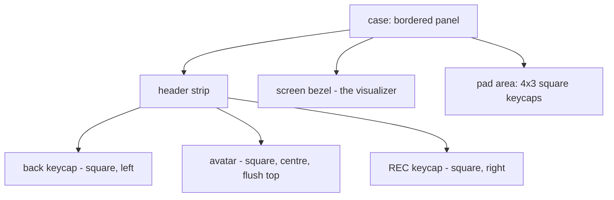

# UI, layout & rendering

The UI is [`egui`](https://github.com/emilk/egui) / `eframe`, immediate-mode: there
are no retained widget objects for the sampler — every frame recomputes geometry
from the live window rectangle and paints. This makes the faceplate reflow fluidly
on resize with no fixed pixel grid.

## Fluid faceplate layout

`app/src/ui/layout.rs::compute_layout` takes the available `Rect` and returns a `FaceLayout` with
every sub-rectangle for the frame. Everything is derived proportionally, so there
is a single source of truth for geometry.

```mermaid
flowchart TB
    case[case: bordered panel]
    case --> header[header strip]
    header --> back[back keycap - square, left]
    header --> avatar[avatar - square, centre, flush top]
    header --> rec[REC keycap - square, right]
    case --> screen[screen bezel - the visualizer]
    case --> pads[pad area: 4x3 square keycaps]
```

Notes:

- The **back** and **REC** buttons are both square keycaps of equal size, on the
  left and right of the header; the profile **avatar** is a square centred flush
  with the top edge.
- The **screen** is where the active visualizer draws (`layout.screen`).
- The **pads** are a `PAD_ROWS × PAD_COLS` grid of square keycaps, centred and size-
  capped so they stay reasonable on large windows.

## Rendering

The sampler screen is painted through a cloned `egui::Painter` rather than
widgets, almost entirely from the **skin** spritesheet:

| Piece | Where | Role |
|-------|-------|------|
| `Skin` | `ui/skin.rs` | Loads `skin.png` + `skin.json`; draws sprites, nine-slices and key caps. |
| atlas | `core/src/config/atlas.rs` | Fixed sprite rectangles inside `skin.png` (the contract with `genskin`). |
| `Renderer` | `ui/renderer.rs` | The device case + screen bezel (skin nine-slices). |
| `Pad` | `ui/pad.rs` | Pad state machine + input; drawn as skin caps with press sink, record pulse, LED. |
| widgets | `ui/widgets.rs` | Kid-face placeholder avatar. |
| visualizers | `ui/visualizer.rs`, `ui/vowel_visualizer.rs` | See [The visualizer](visualizer.md). |

## The shell (every screen except the sampler)

Everything outside the sampler (Home, Hub, profile form, voice check, games menu,
settings page) is drawn with the **shell kit** in `ui/shell.rs`, in the **arcade
style** shared with the games' entrance screens and the README pictures: a navy
night with a slowly twinkling starfield and 80s stripe bands, chunky notched
keycaps with a hard ink outline and a bevel, pixel titles, and vivid colours that
sit calmly on the deep navy.

The palette and the pixel bitmaps (icons, and the six bold lowercase vowels) are
data in **`rondelek_core::arcade`**, shared with the game's raylib kit
(`game/src/arcade.rs`), so the app and the games can't drift apart. A child's
card colour comes from there too (`tile_color(uid)`), identical everywhere.

**Two fonts, by audience.** Kid-facing words (titles, big keys, names) use the
**Tiny5** pixel font (`pixel_font`, the `pixel` family; sizes snap to multiples
of 9 so it stays crisp). Grown-up body text (descriptions, hints, form labels)
stays in Space Grotesk, which reads better in sentences. The vowels are never
set in the pixel font's lowercase, which turns ambiguous at size; they are drawn
from their own bitmaps (`pixel_vowel`, `KeyButton::vowel`).

| Piece | Role |
|-------|------|
| `install_fonts`, `apply_style` | Space Grotesk + Tiny5 (`pixel` family); egui's **dark** theme restyled for its stock widgets (navy surfaces, cream text, square corners). |
| `background`, `stripes`, `inside_stripes` | The night sky + stars (twinkling on the app's slow idle repaint, no extra frames), and the stripe bands, painted on a layer above the page so scrolling content slides under them. Screens lay out inside `inside_stripes`. |
| `draw_keycap`, `KeyButton` | Arcade keycaps: hard shadow, ink outline, a bevelled face on a dark lip that sinks when pressed. Labels in the pixel font; `KeyButton::vowel` draws a pixel vowel. `KeyButton` implements `egui::Widget`. |
| `segmented` | A row of keycaps acting as radio buttons; the chosen one is butter and framed. |
| `notched`, `panel`, `highlight`, `card` | The 8-bit shapes: corner-cut rectangles, bevelled panels, the cyan "this one" frame (a line and an ink gap), and a card around ui content. |
| `paint_avatar`, `badge`, `tile_color` | Avatar in an ink-framed well (photo, character or drawn face), square status badges, each child's colour. |
| `pixel_text`, `pixel_icon`, `pixel_vowel` | Pixel text with an optional hard shadow; the shared bitmaps. |
| `Icon`, `draw_icon` | Vector icons (back, gear, mic, pads, star, …), with no icon font needed. |
| `title`, `hint`, `pixel_wordmark` | Butter pixel headings over an ink shadow, dim secondary text, the 5×7 "RONDELEK" wordmark. |

Every clickable shell widget reports an **AccessKit label**, which is what the
settings page's UI tests use to find and click controls.

Screens live in `app/src/app/`, one file each: `home.rs` ("Who's playing?"),
`hub.rs` (the child's three big tiles), `profile_form.rs`, `calibrate.rs` (voice
check), `games.rs`, `settings.rs` (glue for the settings page) and `sampler.rs`.

### Character avatars

`rondelek_core::characters` (`core/src/characters.rs`, shared with the games'
profile picker) embeds `assets/avatars/<name>.png`, generated placeholders from
`cargo run --bin genavatars`. Profiles store the character's *name*
(`ProfileManifest::character`), so replacing a PNG updates every profile using it.
See `assets/avatars/README.md`.

## Theming & fonts

- **Skins** own the look: one `skin.png` spritesheet plus `skin.json` colour
  overrides. The base skin is generated by `cargo run --bin genskin` into
  `skins/base/` and embedded; a user skin that is missing a file falls back to it.
  See `docs/SKINS.md`. There is no dark mode.
- **Theme** (`core/src/config/theme.rs`) is the colour struct for everything in
  the sampler still drawn procedurally (visualizers, LEDs, text): `theme_light()`
  defaults, overridden by the skin's `skin.json`. The shell screens use the fixed
  `shell::palette` instead, so a sampler skin never makes the menus unreadable.
- **Fonts**: Space Grotesk (OFL) is embedded and installed as the default
  proportional + monospace family, with `egui`'s default fonts as fallback so
  Cyrillic/Greek still render. Tiny5 (OFL, pixel) is the `pixel` family for the
  shell's kid-facing words; it covers every shipped language itself.
  (`shell::install_fonts`; the settings page's UI tests install them too.)

## Internationalization

`i18n/mod.rs` provides runtime translations:

- `assets/i18n/en.json` is the **source of truth**; `pl, de, fr, es, it, uk` are
  seeded locales. A test fails if keys drift between them.
- Lookup resolves **active locale → English → the key itself**.
- The system language is detected once on first run (`sys-locale`) and saved to
  settings. The flag key on Home opens the settings page at its language grid.
- All locale JSON and picker flags are embedded in the binary.

> When you add or change any user-facing string you must update `en.json` **and**
> every seeded locale. See [Contributing](contributing.md) and `AGENTS.md`.

## The settings page ("For grown-ups")

`ui/settings_page.rs` is **one scrolling page** of cards. It replaced the old F12
settings window, and there are no pop-up windows left. It opens from the gear key
(Home, Hub) or `F12`, and the back key returns to where you came from. Each card
says whether it affects **only this child** or **everyone on this computer**.

| Card | Controls | `Settings` fields / data |
|------|----------|--------------------------|
| Child (only with a child selected) | edit name/picture, voice-check status + redo, delete (type the name to confirm; moves to `.trash`) | `profile.json`, `calibration.json` |
| Sound | speaker, volume, test chime, microphone, live level meter | `output_device`, `volume`, `input_device` |
| Voice recognition | Relaxed / Normal / Strict presets (`DetectionPreset`); "advanced" shows the raw knobs | `vowel_*` |
| Sampler screen | spectrum / vowels / off; advanced spectrum knobs | `active_visualizer`, `visualizer_*` |
| Games | steadier ↔ snappier | `game_reaction` |
| Look & language | language flag grid, sampler skin | `language`, `skin` |
| About & data | version, open data folder | |

The page only edits `Settings` and returns a `SettingsOutcome` of *requests*
(switch language, load skin, delete child, play a chime, …). The app carries them
out in `app/settings.rs`. This split keeps the page testable: `settings_page::tests`
renders it headless with `egui_kittest`, clicks controls by label and asserts on
`Settings`. Changes save immediately.

## Level meter & camera

- **Level meter** (`ui/level_meter.rs`) is an input-level bar with a translated
  status line (too quiet / OK / too loud), shown in the voice check and on the
  settings page.
- **Camera** (`camera/mod.rs`) shows its live preview **inline in the profile
  form**, at the webcam's native aspect ratio with a centred square crop guide.
