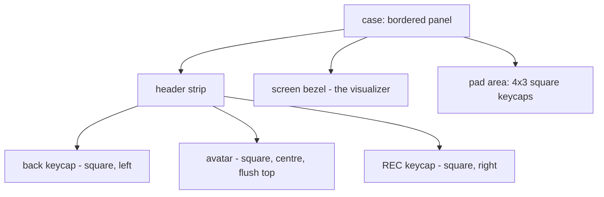

# UI, layout & rendering

Come on in. This page walks you through everything you can see in the app: how
the sampler lays itself out, how it gets painted, the arcade-style screens
around it, and the grown-ups' settings page.

The UI is built with [`egui`](https://github.com/emilk/egui) / `eframe`, which is
immediate-mode. For the sampler that means there are no widget objects kept
around between frames. Every frame, the app looks at the live window rectangle,
works out the geometry from scratch and paints. That's why the faceplate reflows
smoothly when you resize the window: there's no fixed pixel grid to fight with.

## Fluid faceplate layout

Here's where all the sampler's geometry comes from.
`app/src/ui/layout.rs::compute_layout` takes the available `Rect` and hands back
a `FaceLayout` holding every sub-rectangle for the frame. Everything is worked
out in proportion to the window, so there's exactly one place to look when you
want to know where something sits.

```mermaid
flowchart TB
    case[case: bordered panel]
    case --> header[header strip]
    header --> back[back keycap - square, left]
    header --> avatar[avatar - square, centre, flush top]
    header --> rec[REC keycap - square, right]
    case --> screen[screen bezel - the visualizer]
    case --> pads[pad area: 4x3 square keycaps]
```

A few things worth knowing:

- The **back** and **REC** buttons are square keycaps of the same size, one on
  each side of the header. The profile **avatar** sits between them, also
  square, centred and flush with the top edge.
- The **screen** is where the active visualizer draws (`layout.screen`).
- The **pads** are a `PAD_ROWS × PAD_COLS` grid of square keycaps. They're
  centred, and their size is capped so they don't turn into giant slabs on a big
  window.

## Rendering

The sampler screen doesn't use widgets at all. It's painted through a cloned
`egui::Painter`, and nearly all of it comes straight from the **skin**
spritesheet. Here's who does what:

| Piece | Where | Role |
|-------|-------|------|
| `Skin` | `ui/skin.rs` | Loads `skin.png` + `skin.json`; draws sprites, nine-slices and key caps. |
| atlas | `core/src/config/atlas.rs` | Fixed sprite rectangles inside `skin.png` (the contract with `genskin`). |
| `Renderer` | `ui/renderer.rs` | The device case + screen bezel (skin nine-slices). |
| `Pad` | `ui/pad.rs` | Pad state machine + input; drawn as skin caps with press sink, record pulse, LED. |
| widgets | `ui/widgets.rs` | Kid-face placeholder avatar. |
| visualizers | `ui/visualizer.rs`, `ui/vowel_visualizer.rs` | See [The visualizer](visualizer.md). |

## The shell (every screen except the sampler)

Step outside the sampler and you're in the **shell**. Home, Hub, the profile
form, voice calibration, the games menu and the settings page are all drawn with
the **shell kit** in `ui/shell.rs`. It uses the same **arcade style** as the
games' entrance screens and the README pictures: a navy night sky with a slowly
twinkling starfield and 80s stripe bands, chunky notched keycaps with a hard ink
outline and a bevel, pixel titles, and vivid colours that still sit calmly on
the deep navy.

The palette and the pixel bitmaps (icons, plus the six bold lowercase vowels)
live as plain data in **`rondelek_core::arcade`**. The game's raylib kit
(`game/src/arcade.rs`) reads the same data, so the app and the games can't drift
apart. Each child's card colour comes from there too (`tile_color(uid)`), so a
child is the same colour everywhere they look.

**Two fonts, one for each audience.** Words meant for kids (titles, big keys,
names) use the **Tiny5** pixel font (`pixel_font`, the `pixel` family). Its sizes
snap to multiples of 9 so it stays crisp. Words meant for grown-ups
(descriptions, hints, form labels) stay in Space Grotesk, which is much nicer to
read in whole sentences. The vowels get special care: they're never set in the
pixel font's lowercase, which gets ambiguous when it's blown up. Instead they're
drawn from their own bitmaps (`pixel_vowel`, `KeyButton::vowel`).

Here's what's in the kit:

| Piece | Role |
|-------|------|
| `install_fonts`, `apply_style` | Space Grotesk + Tiny5 (`pixel` family); egui's **dark** theme restyled for its stock widgets (navy surfaces, cream text, square corners). |
| `background`, `stripes`, `inside_stripes` | The night sky + stars (twinkling on the app's slow idle repaint, no extra frames), and the stripe bands, painted on a layer above the page so scrolling content slides under them. Screens lay out inside `inside_stripes`. |
| `draw_keycap`, `KeyButton` | Arcade keycaps: hard shadow, ink outline, a bevelled face on a dark lip that sinks when pressed. Labels in the pixel font; `KeyButton::vowel` draws a pixel vowel. A key grows wider than its `size` when its label (in some language) wouldn't fit. `KeyButton` implements `egui::Widget`. |
| `segmented` | A row of keycaps acting as radio buttons; the chosen one is butter and framed. |
| `notched`, `panel`, `highlight`, `card` | The 8-bit shapes: corner-cut rectangles, bevelled panels, the cyan "this one" frame (a line and an ink gap), and a card around ui content. |
| `paint_avatar`, `badge`, `tile_color` | Avatar in an ink-framed well (photo, character or drawn face), square status badges, each child's colour. |
| `pixel_text`, `pixel_icon`, `pixel_vowel` | Pixel text with an optional hard shadow; the shared bitmaps. |
| `Icon`, `draw_icon` | Vector icons (back, gear, mic, pads, star, …), with no icon font needed. |
| `title`, `hint`, `pixel_wordmark` | Butter pixel headings over an ink shadow, dim secondary text, the 5×7 "RONDELEK" wordmark. |

Every clickable shell widget reports an **AccessKit label**. That's how the
settings page's UI tests find the controls and click them, so please give your
new buttons one too.

Each screen has its own file in `app/src/app/`: `home.rs` ("Who's playing?"),
`hub.rs` (the child's three big tiles), `profile_form.rs`, `calibrate.rs` (voice
calibration), `games.rs`, `settings.rs` (glue for the settings page) and
`sampler.rs`. The hub's tiles make room for long labels with `fit_label`: one
line in the big pixel size if it fits, otherwise two lines split at the middle
space ("Calibrage / de la voix"), and failing that, the small size.

### Character avatars

Not every child wants a photo, so there are characters to pick from.
`rondelek_core::characters` (`core/src/characters.rs`, shared with the games'
profile picker) embeds `assets/avatars/<name>.png`. You'll find two sets, and
the picture picker offers both:

- the **pixel pals** (`pixel-fox`, `pixel-cat`, …): vivid 32×32 pixel art in the
  arcade look, made by `cargo run --bin genpixelpals`, and listed first;
- the **classic** smooth set (`fox`, `cat`, …), made by
  `cargo run --bin genavatars`.

The app scales pixel pals with mipmaps and nearest-neighbour magnification
(`characters::is_pixel`), so their pixels stay nice and square. A profile stores
the character's *name* (`ProfileManifest::character`), not the picture, so if
you replace a PNG, every profile using that character picks up the new one. See
`assets/avatars/README.md`.

## Theming & fonts

- **Skins** own the sampler's look: one `skin.png` spritesheet plus `skin.json`
  colour overrides. Two come built in (`ui::skin::BUILTIN`): **Arcade**
  (`genarcadeskin`, the default when nobody has chosen one) and **Classic**
  (`genskin`, `skins/base/`, which is also the fallback for any file a skin
  leaves out). `Skin::load` takes the chosen name and tries, in order: an
  installed skin of that name, then the built-in, then the default. The
  grown-ups page lists Arcade, Classic, then any installed skins. See
  `docs/SKINS.md`. There is no dark mode.
- **Theme** (`core/src/config/theme.rs`) is the colour struct for the parts of
  the sampler that are still drawn in code (visualizers, LEDs, text). It starts
  from the `theme_light()` defaults, and the skin's `skin.json` overrides them.
  The shell screens use the fixed `shell::palette` instead, so a wild sampler
  skin can never make the menus unreadable.
- **Fonts**: Space Grotesk (OFL) is embedded and installed as the default
  proportional + monospace family, with `egui`'s default fonts behind it as a
  fallback so Cyrillic and Greek still render. Tiny5 (OFL, pixel) is the `pixel`
  family for the shell's kid-facing words, and it covers every shipped language
  on its own. (This all happens in `shell::install_fonts`; the settings page's
  UI tests install the fonts too.)

## Internationalization

The app speaks several languages, and `i18n/mod.rs` is where it learns them:

- `assets/i18n/en.json` is the **source of truth**; `pl, de, fr, es, it, uk` are
  seeded locales. A test fails if the keys drift apart between them.
- Lookup goes **active locale → English → the key itself**, so a missing
  translation shows English rather than nothing.
- The system language is detected once, on first run (`sys-locale`), and saved
  to settings. The flag key on Home opens the settings page right at its
  language grid.
- All locale JSON and picker flags are embedded in the binary.
- Dates shown to grown-ups go through `ui/when.rs` (`when::friendly`): local
  time via `chrono`, as "Today, 14:05" / "Yesterday, 09:12" / "26 September,
  14:05" (the year appears only when it isn't this year). The word order and
  the month names are translations too (`when.*`), so German reads
  "26. September" and Spanish "26 de septiembre".

> When you add or change any user-facing string you must update `en.json` **and**
> every seeded locale. See [Contributing](contributing.md) and `AGENTS.md`.

## The settings page ("For grown-ups")

This is the grown-ups' corner. `ui/settings_page.rs` is **one scrolling page** of
cards. It replaced the old F12 settings window, and there are no pop-up windows
left anywhere. You open it with the gear key (on Home and Hub) or `F12`, and the
back key takes you back to wherever you came from. Each card tells you whether
it affects **only this profile** or **everyone on this computer**.

| Card | Controls | `Settings` fields / data |
|------|----------|--------------------------|
| Profile (only with a child selected) | edit name/picture, voice calibration status + calibrate again, delete the profile (type the name to confirm; moves to `.trash`) | `profile.json`, `calibration.json` |
| Sessions (only with a child selected) | the child's sessions, newest first: friendly date, "n of 12 pads recorded", the one **Sounds** carries on with marked and keyed **Continue**, **Open** on the others; the latest five (plus the current one) until "Show all"; **New session with empty pads** | `sessions/*/session.json` (read via `Profile::list_sessions`) |
| Sound | speaker, volume, test chime, microphone, live level meter | `output_device`, `volume`, `input_device` |
| Voice recognition | Relaxed / Normal / Strict presets (`DetectionPreset`); "advanced" shows the raw knobs | `vowel_*` |
| Sampler screen | spectrum / vowels / off; advanced spectrum knobs | `active_visualizer`, `visualizer_*` |
| Games | steadier ↔ snappier | `game_reaction` |
| Look & language | language flag grid, sampler skin | `language`, `skin` |
| About & data | version, open data folder | |

The page itself only edits `Settings`. Anything bigger comes back as a
`SettingsOutcome` full of *requests* (switch language, load skin, delete child,
open a session, play a chime, …), and the app carries them out in
`app/settings.rs`. Opening a session first closes (and saves) any session that's
already open, so it works even when the page was opened from the sampler.

Why the split? It keeps the page easy to test. `settings_page::tests` renders it
headless with `egui_kittest`, clicks controls by their labels and checks what
ended up in `Settings`. Changes save straight away; there's no "Apply" button to
forget.

## Level meter & camera

- The **level meter** (`ui/level_meter.rs`) is an input-level bar with a
  translated status line underneath (too quiet / OK / too loud). You'll see it
  in voice calibration and on the settings page.
- The **camera** (`camera/mod.rs`) shows its live preview **inline in the
  profile form**, at the webcam's native aspect ratio, with a centred square
  crop guide so you know what ends up in the avatar.
