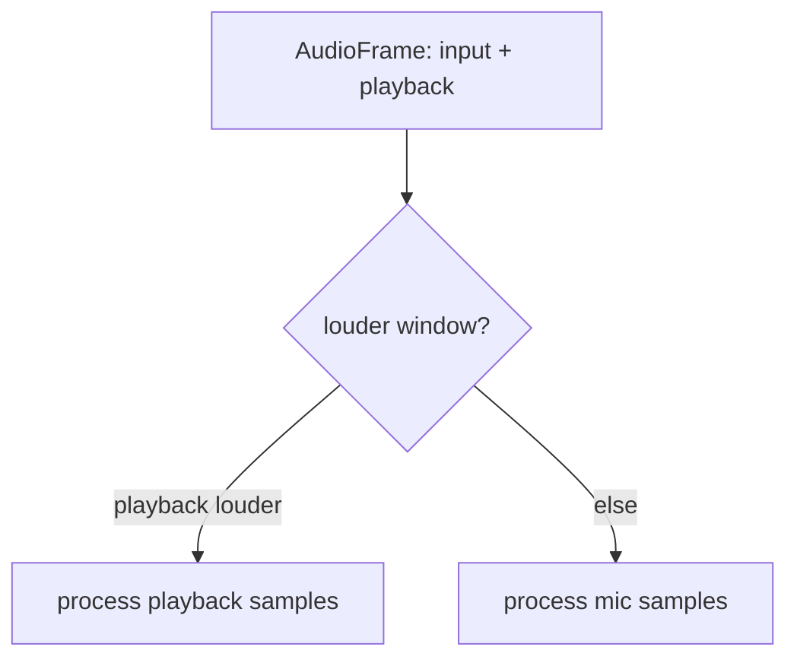
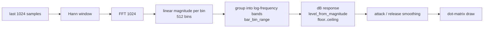
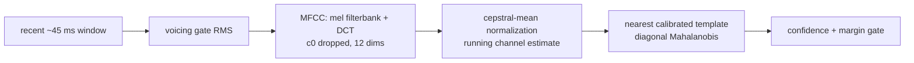
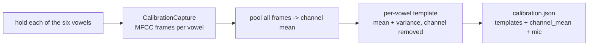

# The visualizer

The visualizer is a **pluggable** subsystem: the app owns a
`Box<dyn Visualizer>`, and the current dot-matrix spectrum is just one
implementation (`SpectrumVisualizer`). New styles (waveform, VU meter, scope) can
be added without touching the app wiring. Everything lives in
`src/ui/visualizer.rs`.

## The interface

```rust
pub struct AudioFrame<'a> {
    pub input: &'a [f32],      // microphone tap
    pub playback: &'a [f32],   // playback monitor tap
    pub input_rate: u32,
    pub playback_rate: u32,
}

pub trait Visualizer {
    fn update(&mut self, frame: &AudioFrame, settings: &Settings);
    fn draw(&self, painter: &Painter, rect: Rect, theme: &Theme, settings: &Settings);
    fn demo_fill(&mut self, _num_bars: usize) {}   // for screenshots; default no-op
}
```

`App::drain_capture` builds an `AudioFrame` from both taps (see
[Audio routing](audio.md)) and calls `update` **only on frames that brought new
audio**, so the smoothing/decay cadence follows the sound rather than the render
frame rate. `draw` is called every frame from `draw_session`.

### Source selection

`SpectrumVisualizer::update` picks whichever tap is **louder** over the last FFT
window (`louder_window`). This automatically follows the sound with no coupling to
UI mode: the mic wins while recording, the (full-scale) playback monitor wins while
a clip plays. Ties favour the mic.



## The spectrum DSP pipeline



Three design decisions matter here, each learned from real behaviour:

1. **Logarithmic frequency bands** (`bar_bin_range`). FFT bins map *linearly* to
   frequency, but almost all speech energy sits below ~4 kHz (the bottom ~18% of
   bins). Linear grouping clumped all movement into the leftmost few bars. Log
   bands give each bar a geometrically wider frequency range, so the energy-dense
   low end spreads across many bars and the display fills at any bar count.

2. **Decibel response** (`level_from_magnitude`). Loudness is perceived
   logarithmically, so bar height is a dB mapping across a `[floor, ceiling]`
   window (ceiling fixed at −12 dB; floor user-tunable, default −60 dB) rather than
   a linear gain. Normal speech lands in the lively middle; loud input tops out
   gracefully instead of pinning.

3. **Attack / release smoothing**. Rises use `visualizer_smoothing` (fast attack),
   falls use `visualizer_decay` (slow release) — classic peak-meter behaviour.

All of this is **display-only** — it never touches recorded or played audio.

### Tunable knobs (Settings → Visualizer)

Open **Settings** (`F12`) and pick the **Visualizer** tab. It exposes:

| Control | Setting | Effect |
|---------|---------|--------|
| Smoothing | `visualizer_smoothing` | Attack speed (higher = smoother rise). |
| Decay | `visualizer_decay` | Release speed. |
| Bars | `visualizer_num_bars` | Number of columns. |
| Floor (dB) | `visualizer_floor_db` | Sensitivity — lower = more movement. |

These persist in the settings JSON (see [Data model](data-model.md)).

## Cycling between visualizers

The app owns a `Vec<Box<dyn Visualizer>>` plus an `active_visualizer` index. The
**square button just left of REC** (`layout.cycle`) calls `App::cycle_visualizer`,
which advances the index (wrapping around) and persists it to settings. Only the
active visualizer is fed audio (`update`) and drawn each frame. Two ship today:
the [spectrum](#the-spectrum-dsp-pipeline) and the [vowel meter](#vowel-detection).

## Vowel detection

`VowelVisualizer` (`ui/vowel_visualizer.rs`) shows the detected Polish vowel as a
large letter plus a match meter per vowel (**a e i o u y**). It runs the single
detector against the active profile's calibration; an uncalibrated profile is told
to calibrate first (there is no fallback).

The detector lives in `audio/vowel.rs` and matches the **shape of the spectral
envelope** via **MFCCs** — deliberately *not* formants. Estimating formants from a
child's high‑pitched, short‑vocal‑tract voice is a known ill‑posed problem (LPC
reports false formants at high f0) and was the cause of the old detector's
unreliability. Comparing envelope shapes to the child's own templates sidesteps it.



Key choices:

- **MFCC, from a proven crate.** Features come from `spectrograms` (pure‑Rust FFT).
  The only in‑tree code is the ~20‑line nearest‑template classifier. If this ever
  needs onset/pitch or a second opinion, swap the feature source for **aubio** via
  `aubio-rs` (battle‑tested C) — the template code is unchanged.
- **c0 dropped + cepstral‑mean normalization** remove overall gain and the fixed
  microphone colour, so the same mic cancels on both sides (see
  [How calibration works](calibration-explained.md)).
- **Confidence *and* margin gate** (`vowel_show_threshold`, `vowel_margin_threshold`)
  make recognition a firm decision rather than a flickering guess.

Settings → **Detection** tab: **Voicing** threshold, meter **Smoothing**, **Show at**
(confidence), **Min margin**. The detector is unit‑tested by synthesising
source‑filter vowels, building templates, and asserting classification plus gain‑ and
coloration‑invariance.

### Calibration

> **New here?** Read [How calibration works](calibration-explained.md) first — a
> plain-language explanation of the idea (and what it deliberately avoids),
> written for anyone including clinicians. This section covers the implementation.

Detection is **calibration‑only**: a child must calibrate before the vowel view
works. Calibrate from the **Calibrate voice** button on the Sessions screen (or
Settings → Calibration → Recalibrate):



Calibration captures **all six vowels** and builds one MFCC **template** each
(`vowel::build_calibration`):

- The mean MFCC across *all* frames is the **channel (mic) estimate**; it's
  subtracted from every template so the mic's colour is removed.
- Each vowel's template is the mean + per‑dimension variance of its
  channel‑normalized frames (outlier frames trimmed). The variance drives the
  diagonal‑Mahalanobis distance at match time.
- The calibration also stores the `input_device` name, so Settings → Calibration
  can warn when the current mic differs.

The live detector (`VowelDetector`) seeds its running channel mean from the stored
one and adapts slowly, so early frames match well. When a profile isn't calibrated
the vowel view shows **"Not calibrated — set up the child's voice first"** and
matches nothing.

Flow (`app.rs`): `begin_calibration` → `draw_calibrate` shows an **overview grid** of
the six vowels (recorded ones turn green with a ✓). Tapping a vowel opens its **record
screen**, where the child records by **holding** a button (or Space) — push‑to‑talk,
**no auto‑advance**. `pump_calibration` feeds voiced MFCC frames into `current` only
while held; releasing commits the take to `captured[i]` if it has at least
`vowel::MIN_CAPTURE_SAMPLES` frames (a live level meter + progress bar show while
recording). Any vowel can be re‑recorded by opening it again. Once all six are
captured, **Save** calls `finish_calibration`, which builds the templates, writes
`calibration.json`, and calls `apply_profile_calibration` to push the calibration to
the visualizers via `Visualizer::set_calibration`. Screenshot harness:
`RONDELEK_SCREEN=calibrate` (optionally `RONDELEK_CALIB_VOWEL=<0-5>` to open a vowel's
record screen).

## Adding a new visualizer

1. Create a struct implementing `Visualizer` (`update` + `draw`, optionally
   `demo_fill`).
2. Consume whichever of `frame.input` / `frame.playback` you need — the rates are
   available for time/frequency-axis visualizers.
3. Add it to the `visualizers` vector in `App::new`; the cycle button picks it up
   automatically.

Because the app only knows the trait, nothing else has to change.
