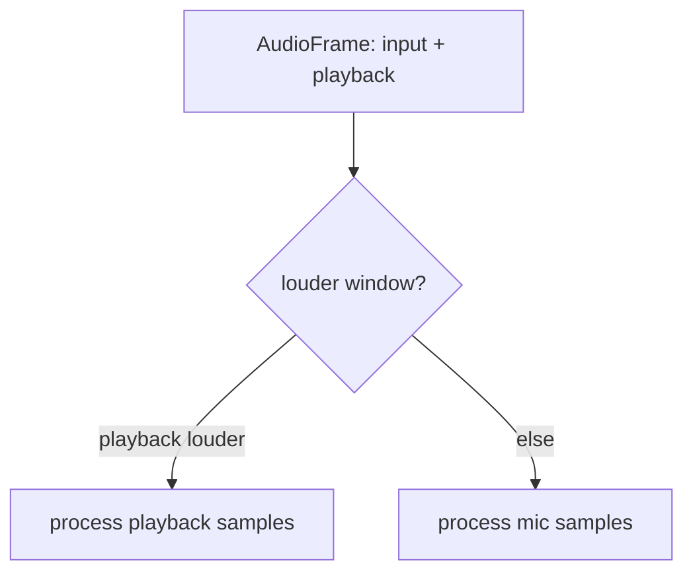
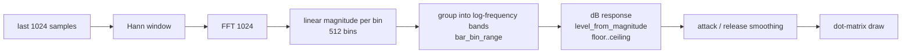

# The visualizer

The visualizer is a **pluggable** subsystem: the app owns a
`Box<dyn Visualizer>`, and the current dot-matrix spectrum is just one
implementation (`SpectrumVisualizer`). New styles (waveform, VU meter, scope) can
be added without touching the app wiring. Everything lives in
`src/ui/visualizer.rs`.

## The interface

```rust
pub struct AudioFrame<'a> {
    pub input: &'a [f32],      // microphone tap
    pub playback: &'a [f32],   // playback monitor tap
    pub input_rate: u32,
    pub playback_rate: u32,
}

pub trait Visualizer {
    fn update(&mut self, frame: &AudioFrame, settings: &Settings);
    fn draw(&self, painter: &Painter, rect: Rect, theme: &Theme, settings: &Settings);
    fn demo_fill(&mut self, _num_bars: usize) {}   // for screenshots; default no-op
}
```

`App::drain_capture` builds an `AudioFrame` from both taps (see
[Audio routing](audio.md)) and calls `update` **only on frames that brought new
audio**, so the smoothing/decay cadence follows the sound rather than the render
frame rate. `draw` is called every frame from `draw_session`.

### Source selection

`SpectrumVisualizer::update` picks whichever tap is **louder** over the last FFT
window (`louder_window`). This automatically follows the sound with no coupling to
UI mode: the mic wins while recording, the (full-scale) playback monitor wins while
a clip plays. Ties favour the mic.



## The spectrum DSP pipeline



Three design decisions matter here, each learned from real behaviour:

1. **Logarithmic frequency bands** (`bar_bin_range`). FFT bins map *linearly* to
   frequency, but almost all speech energy sits below ~4 kHz (the bottom ~18% of
   bins). Linear grouping clumped all movement into the leftmost few bars. Log
   bands give each bar a geometrically wider frequency range, so the energy-dense
   low end spreads across many bars and the display fills at any bar count.

2. **Decibel response** (`level_from_magnitude`). Loudness is perceived
   logarithmically, so bar height is a dB mapping across a `[floor, ceiling]`
   window (ceiling fixed at −12 dB; floor user-tunable, default −60 dB) rather than
   a linear gain. Normal speech lands in the lively middle; loud input tops out
   gracefully instead of pinning.

3. **Attack / release smoothing**. Rises use `visualizer_smoothing` (fast attack),
   falls use `visualizer_decay` (slow release) — classic peak-meter behaviour.

All of this is **display-only** — it never touches recorded or played audio.

### Tunable knobs (dev panel)

Open the dev panel with `Ctrl+Shift+D`. It exposes:

| Control | Setting | Effect |
|---------|---------|--------|
| Smoothing | `visualizer_smoothing` | Attack speed (higher = smoother rise). |
| Decay | `visualizer_decay` | Release speed. |
| Bars | `visualizer_num_bars` | Number of columns. |
| Floor (dB) | `visualizer_floor_db` | Sensitivity — lower = more movement. |

These persist in the settings JSON (see [Data model](data-model.md)).

## Adding a new visualizer

1. Create a struct implementing `Visualizer` (`update` + `draw`, optionally
   `demo_fill`).
2. Consume whichever of `frame.input` / `frame.playback` you need — the rates are
   available for time/frequency-axis visualizers.
3. Construct it in `App::new` as the boxed `visualizer` (or, later, add a picker).

Because the app only knows the trait, nothing else has to change.
