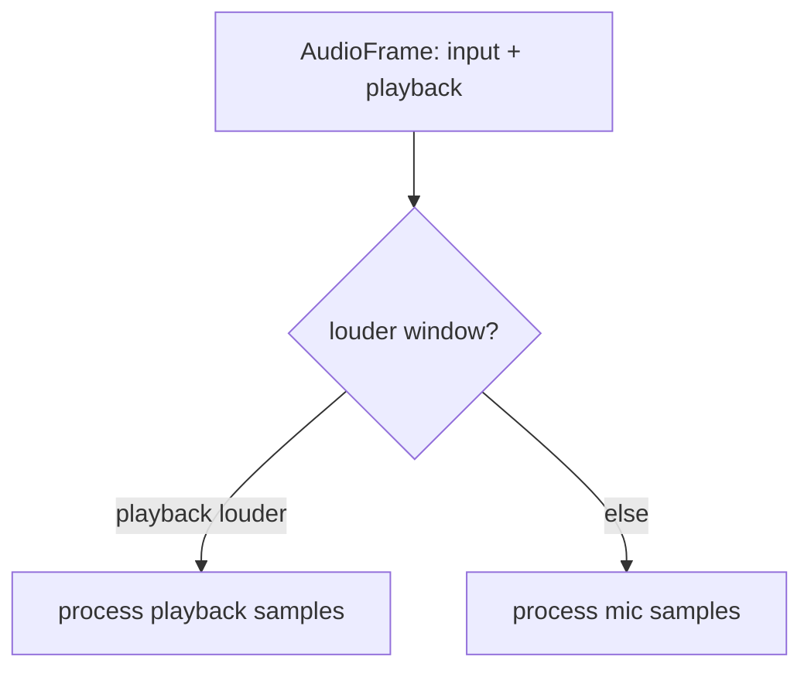
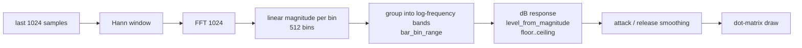
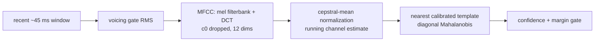
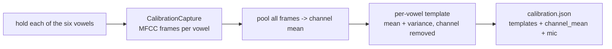

# The visualizer

The visualizer is the little screen above the pads that dances along with the
sound. It's a **pluggable** subsystem: the app owns a `Vec<Box<dyn Visualizer>>`
and cycles through it. Three implementations ship today:

- `SpectrumVisualizer`, a dot-matrix spectrum,
- `VowelVisualizer`, a vowel meter,
- `OffVisualizer`, a restful blank screen.

The trait and the spectrum live in `app/src/ui/visualizer.rs`, and the vowel meter
is in `app/src/ui/vowel_visualizer.rs`. The vowel detector itself is GUI-free and
lives in `core/src/audio/vowel.rs`.

## The interface

```rust
pub struct AudioFrame<'a> {
    pub input: &'a [f32],      // microphone tap
    pub playback: &'a [f32],   // playback monitor tap
    pub input_rate: u32,
    pub playback_rate: u32,
}

pub trait Visualizer {
    fn update(&mut self, frame: &AudioFrame, settings: &Settings);
    fn draw(&self, painter: &Painter, rect: Rect, theme: &Theme, settings: &Settings);
    fn demo_fill(&mut self, _num_bars: usize) {}   // for screenshots; default no-op
    fn set_calibration(&mut self, _cal: Option<VowelCalibration>) {} // active profile's; default no-op
}
```

`App::drain_capture` builds an `AudioFrame` from both taps (see
[Audio routing](audio.md)) and calls `update` **only on frames that brought new
audio**. That way the smoothing and decay keep time with the sound, not with the
render frame rate. `draw`, on the other hand, is called every frame from
`draw_session`.

### Source selection

Should the display show the microphone or what's playing? `SpectrumVisualizer::update`
settles it simply: whichever tap is **louder** over the last FFT window wins
(`louder_window`). It follows the sound on its own, with no ties to the UI mode.
While a child records, the mic wins; while a clip plays, the (full-scale) playback
monitor wins. If it's a tie, the mic gets it.


```mermaid
flowchart TD
    frame[AudioFrame: input + playback] --> e{louder window?}
    e -->|playback louder| p[process playback samples]
    e -->|else| m[process mic samples]
```

## The spectrum DSP pipeline


```mermaid
flowchart LR
    win[last 1024 samples] --> hann[Hann window]
    hann --> fft[FFT 1024]
    fft --> mag[linear magnitude per bin<br/>512 bins]
    mag --> bands[group into log-frequency bands<br/>bar_bin_range]
    bands --> db[dB response<br/>level_from_magnitude<br/>floor..ceiling]
    db --> smooth[attack / release smoothing]
    smooth --> draw[dot-matrix draw]
```

Three design choices make the bars feel lively, and each one was learned by
watching how the display actually behaved:

1. **Logarithmic frequency bands** (`bar_bin_range`). FFT bins map to frequency
   *linearly*, but nearly all the energy in speech sits below about 4 kHz, in the
   bottom 18% or so of the bins. Grouping bins linearly bunched all the movement
   into the leftmost few bars. Log bands give each bar a geometrically wider slice
   of frequency, so the busy low end spreads out across many bars and the display
   fills nicely at any bar count.

2. **Decibel response** (`level_from_magnitude`). Our ears hear loudness
   logarithmically, so bar height is a dB mapping across a `[floor, ceiling]`
   window rather than a linear gain. The ceiling is fixed at −12 dB; the floor is
   adjustable and defaults to −60 dB. Normal speech lands in the lively middle,
   and loud input tops out gracefully instead of pinning.

3. **Attack / release smoothing.** Rises use `visualizer_smoothing` (a fast
   attack) and falls use `visualizer_decay` (a slow release). It's the classic
   peak-meter feel.

All of this is **display-only**. None of it ever touches the audio that's recorded
or played.

### Tunable knobs (settings page → Sampler screen)

Open the settings page (`F12`), find the **Sampler screen** card and tick
**Show advanced settings**. You'll find these:

| Control | Setting | Effect |
|---------|---------|--------|
| Smoothness | `visualizer_smoothing` | Attack speed (higher = smoother rise). |
| How fast bars fall | `visualizer_decay` | Release speed. |
| Number of bars | `visualizer_num_bars` | Number of columns. |
| Sensitivity (dB) | `visualizer_floor_db` | The floor; lower = more movement. |

They're saved in the settings JSON (see [Data model](data-model.md)).

## Cycling between visualizers

Alongside its `Vec<Box<dyn Visualizer>>`, the app keeps an `active_visualizer`
index. The **square button just left of REC** (`layout.cycle`) calls
`App::cycle_visualizer`, which moves the index along (wrapping round at the end)
and saves it to settings. Only the active visualizer is fed audio (`update`) and
drawn each frame. Three ship today: the [spectrum](#the-spectrum-dsp-pipeline),
the [vowel meter](#vowel-detection), and "off".

## Vowel detection

`VowelVisualizer` (`ui/vowel_visualizer.rs`) shows the Polish vowel it hears as a
big letter, with a match meter for each vowel (**a e i o u y**). It runs the one
and only detector against the active profile's calibration. If a profile hasn't
been calibrated yet, it kindly says so and asks for a calibration first (there is
no fallback).

The detector lives in `core/src/audio/vowel.rs`. It matches the **shape of the
spectral envelope** using **MFCCs**, and it deliberately does *not* use formants.
Estimating formants from a child's high-pitched, short-vocal-tract voice is a
known ill-posed problem (LPC reports false formants at high f0), and it was the
reason the old detector was so unreliable. Comparing envelope shapes against the
child's own templates steps neatly around it.


```mermaid
flowchart LR
    win[recent ~45 ms window] --> gate[voicing gate RMS]
    gate --> mfcc[MFCC: mel filterbank + DCT<br/>c0 dropped, 12 dims]
    mfcc --> cmn[cepstral-mean normalization<br/>running channel estimate]
    cmn --> cls[nearest calibrated template<br/>diagonal Mahalanobis]
    cls --> gate2[confidence + margin gate]
```

The choices that matter:

- **MFCCs, from a proven crate.** The features come from `spectrograms` (a
  pure-Rust FFT). The only home-grown code is the roughly 20-line
  nearest-template classifier. If this ever needs onset or pitch detection, or a
  second opinion, you can swap the feature source for **aubio** via `aubio-rs`
  (battle-tested C) and leave the template code exactly as it is.
- **Dropping c0 and cepstral-mean normalization** remove the overall gain and the
  fixed colour of the microphone. Since the same mic is used for calibration and
  play, its colour cancels out on both sides (see
  [How calibration works](calibration-explained.md)).
- **A confidence *and* a margin gate** (`vowel_show_threshold`,
  `vowel_margin_threshold`) turn recognition into a firm decision rather than a
  flickering guess.

Grown-ups tune this on the settings page's **Voice recognition** card: a
Relaxed / Normal / Strict preset, and behind **Show advanced settings** the raw
knobs (the voicing threshold, meter smoothing, how sure it must be before showing
a vowel, the minimum margin, and steady mode). The detector is unit-tested by
synthesising source-filter vowels, building templates from them, and checking
that classification holds up and is unaffected by gain and mic colouring.

### Calibration

> **New here?** Have a read of [How calibration works](calibration-explained.md)
> first. It explains the idea in plain language (and what it deliberately avoids),
> for anyone at all, grown-ups included. This section is about the implementation.

Detection needs a **voice calibration**, full stop: a child has to calibrate before
the vowel view will work. A grown-up starts one from the **Voice calibration** key
on the Hub, or from the settings page's **Profile** card (**Calibrate the voice**):


```mermaid
flowchart LR
    say[hold each of the six vowels] --> cap[CalibrationCapture<br/>MFCC frames per vowel]
    cap --> pooled[pool all frames -> channel mean]
    pooled --> tmpl[per-vowel template<br/>mean + variance, channel removed]
    tmpl --> save[calibration.json<br/>templates + channel_mean + mic]
```

Calibration captures **all six vowels** and builds one MFCC **template** for each
(`vowel::build_calibration`):

- The mean MFCC across *all* frames is the **channel (mic) estimate**. It's
  subtracted from every template, which takes the mic's colour out.
- Each vowel's template is the mean plus the per-dimension variance of its
  channel-normalized frames (with outlier frames trimmed). The variance drives the
  diagonal-Mahalanobis distance when matching.
- The calibration also remembers the `input_device` name, so the settings page's
  Profile card can gently point out when a different mic is in use now.

The live detector (`VowelDetector`) starts its running channel mean from the stored
one and adapts slowly, so even the first frames match well. When a profile isn't
calibrated, the vowel view shows **"Not calibrated — set up the child's voice
first"** and matches nothing.

Here's how the flow goes (`app/src/app/calibrate.rs`). `begin_calibration` →
`draw_calibrate` shows an **overview grid** of the six vowels, and recorded ones
turn green with a ✓. Tapping a vowel opens its **record screen**, where the child
records by **holding** a button (or Space). It's push-to-talk, with **no
auto-advance**, so nobody gets hurried along. `pump_calibration` feeds voiced MFCC
frames into `current` only while the button is held. Letting go commits the take
to `captured[i]`, as long as it has at least `vowel::MIN_CAPTURE_SAMPLES` frames (a
live level meter and a progress bar keep the child company while recording). Any
vowel can be recorded again just by opening it. Once all six are in, **Save**
calls `finish_calibration`, which builds the templates, writes `calibration.json`,
and calls `apply_profile_calibration` to hand the calibration to the visualizers
via `Visualizer::set_calibration`.

For screenshots, use `RONDELEK_SCREEN=calibrate` (and optionally
`RONDELEK_CALIB_VOWEL=<0-5>` to open a vowel's record screen).

## Adding a new visualizer

Fancy making your own? It only takes a few steps:

1. Create a struct that implements `Visualizer` (`update` + `draw`, and
   `demo_fill` if you like).
2. Use whichever of `frame.input` / `frame.playback` you need. The rates are there
   too, for visualizers with a time or frequency axis.
3. Add it to the `visualizers` vector in `App::new`. The cycle button picks it up
   by itself.
4. Update the `RONDELEK_VIZ` docs and this page. (The saved `active_visualizer` is
   clamped to the vector's length, so nothing else needs to change.)
