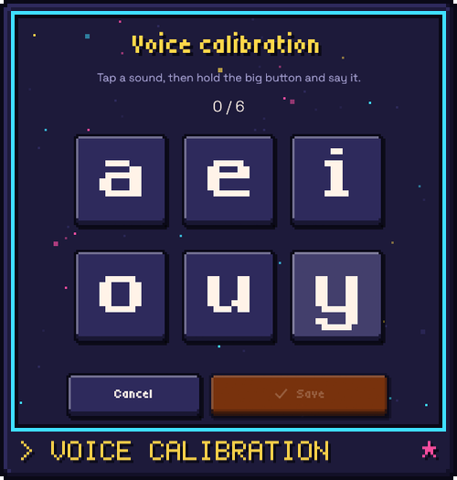

# Voice calibration

If you do just one grown-up thing in Rondelek, make it this one. It takes a
minute or two, and it's what lets the games and the vowel screen understand
your child.

  

## Why it matters

Every child's voice is a little different. A four-year-old's *"aaa"* sounds
nothing like a ten-year-old's, and a laptop's built-in microphone hears things
differently from a headset. So Rondelek doesn't guess from a textbook.
Instead, it listens to **your child** saying the six vowels, remembers what
each one sounds like, and from then on recognises your child against their own
voice.

That's why calibration isn't optional. Without it, the games and the vowel
screen have nothing to compare against, so they simply stay quiet. (The
sound board works either way.) Until it's done, the child's
**Voice calibration** tile says *Start here!*, and the Games screen offers a
shortcut to it.

## Doing it together

1. On your child's screen, tap the yellow **Voice calibration** tile.
2. You'll see six big keys: **a e i o u y**. Tap the first one.
3. Hold the big orange **Hold to record** button (or the `Space` bar) and let
   your child say the sound **and keep it going**, like a little song:
   *"aaaaaa"*. Let go when they stop. A second or two is plenty.
4. Press **Next sound** and do the same for the next vowel. (After the last
   one, the button says **All sounds done** and takes you back.)
5. When all six keys have turned green with a tick, press **Save**. That's it.

While you're recording, a small level bar shows how loud the sound is
arriving. If the app hears noise but not a clear vowel, it gently asks the
child to *keep the sound going*.

## Tips for a great calibration

- **Make it a game.** "Can you sing *aaa* like an opera singer?" "Make an *ooo*
  like an owl!" Children who are having fun give the clearest sounds.
- **Two or three takes per vowel** help a lot. Just hold the button again on
  the same vowel: once a bit higher, once a bit lower, once a bit louder. The
  key shows how many takes it has (*×2*, *×3*). Recognition gets noticeably
  steadier with a little variety.
- **Use the microphone your child will play with**, at about the same
  distance, in a quiet-ish room. The same microphone matters more than a
  fancy one.
- **Watch the level bar.** It should move nicely but not turn red. *Too quiet*
  means move closer, and *too loud* means back off a little.
- **Did one go wrong?** Tap that vowel and press **Start over** to record it
  again. The others stay as they are.

## When to calibrate again

Calibrating again means recording all six vowels afresh. It's just as quick
as the first time, so don't hesitate:

- **You switched microphones**, or moved to a very different room. The
  *For grown-ups* page even notices when the microphone has changed since the
  last calibration, and tells you.
- **The games seem confused**, mixing up two vowels or not reacting.
- **Your child's voice has changed.** Children grow, and their vowels get
  clearer with practice. A fresh calibration now and then keeps up with them.

You can start it from the child's **Voice calibration** tile, or from the
*For grown-ups* page (**Calibrate the voice**, on the Profile card).

## Still a little picky?

If recognition feels too eager or too fussy even after a good calibration,
the *For grown-ups* page has a **Voice recognition** card with three settings:
**Relaxed**, **Normal** and **Strict**. [The grown-ups page](grown-ups.md)
explains them.

Curious how the app actually tells an *a* from an *o*? The next page,
[How it works, in plain words](calibration-explained.md), explains the idea
without any code.
